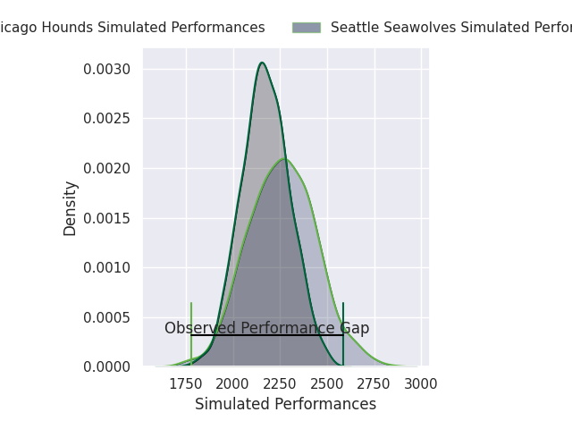
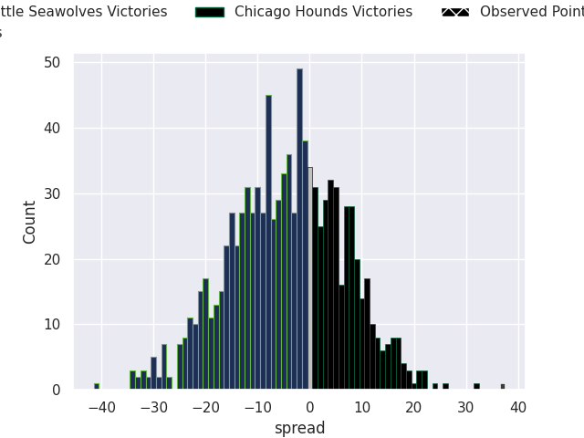

# Seattle Seawolves V Chicago Hounds on 2026/04/24, 22.0 to 59.0

# Club Level Predictions

Now that the game has been played, lets see how the club predictions did. I predicted Seattle Seawolves to win by 4.39, and Chicago Hounds won by 37.0. That's an absolute error of 41.4 for the margin of victory, while my average absolute error has been 14.0 over the past six months. This prediction was more accurate than 4.3% of my recent predictions.

For the Over/Under model, I predicted a total of 50.5 and we have an actual total of 81.0. That's an absolute error of 30.5 compared to a six month average of 13.6. This prediction was more accurate than 7.4% of my recent predictions.
## Projected Performances - Club Model

## Projected Spreads - Club Model

## Projected Results - Club Model

