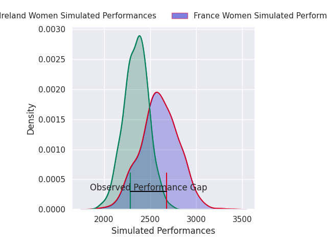
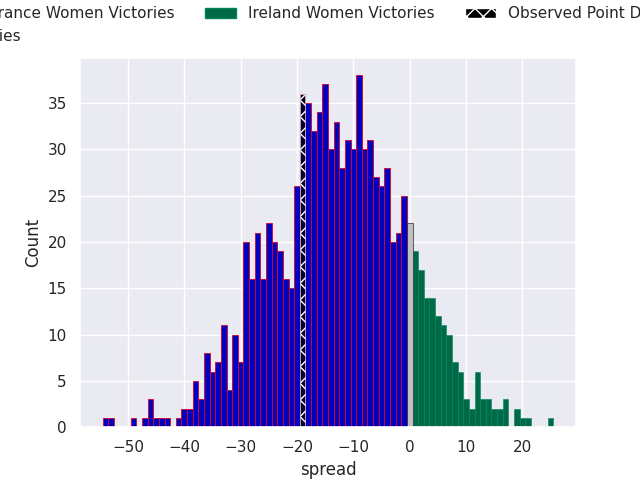
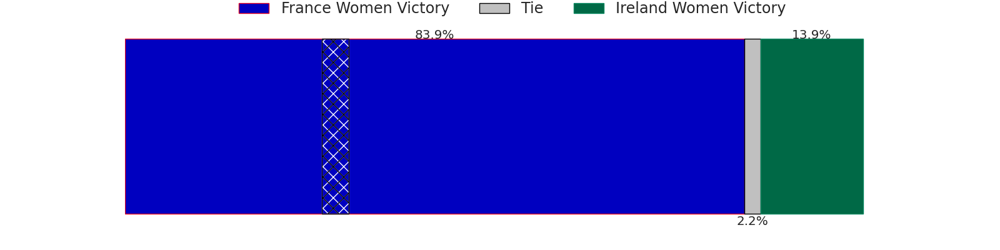

# France Women V Ireland Women on 2026/04/25, 26.0 to 7.0

# Club Level Predictions

Now that the game has been played, lets see how the club predictions did. I predicted France Women to win by 12.62, and France Women won by 19.0. That's an absolute error of 6.4 for the margin of victory, while my average absolute error has been 14.0 over the past six months. This prediction was more accurate than 67.5% of my recent predictions.

For the Over/Under model, I predicted a total of 50.5 and we have an actual total of 33.0. That's an absolute error of 17.5 compared to a six month average of 13.6. This prediction was more accurate than 30.0% of my recent predictions.
## Projected Performances - Club Model

## Projected Spreads - Club Model

## Projected Results - Club Model

