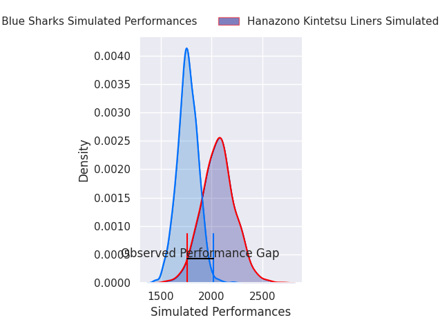
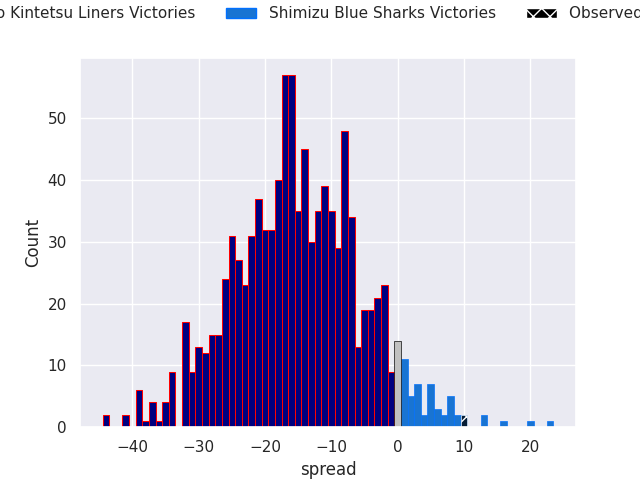
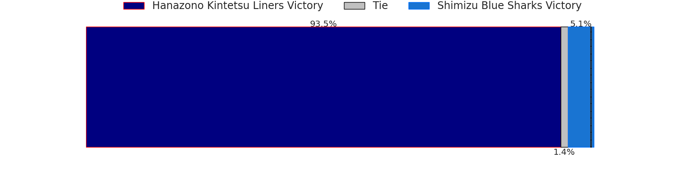
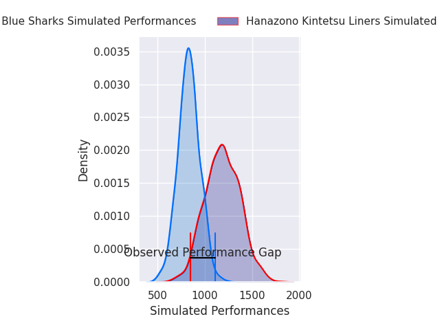
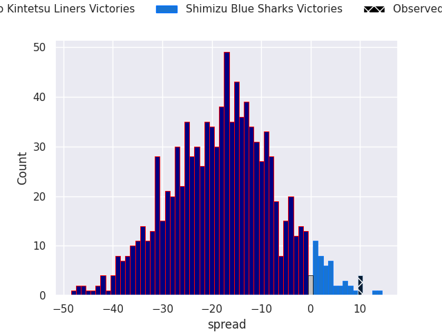
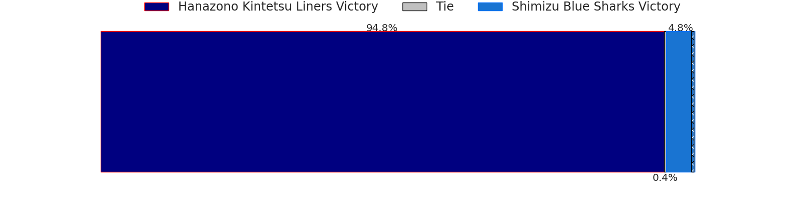

# Hanazono Kintetsu Liners V Shimizu Blue Sharks on 2026/04/25, 19.0 to 29.0

# Club Level Predictions

Now that the game has been played, lets see how the club predictions did. I predicted Hanazono Kintetsu Liners to win by 15.06, and Shimizu Blue Sharks won by 10.0. That's an absolute error of 25.1 for the margin of victory, while my average absolute error has been 13.9 over the past six months. This prediction was more accurate than 15.9% of my recent predictions.

For the Over/Under model, I predicted a total of 50.5 and we have an actual total of 48.0. That's an absolute error of 2.5 compared to a six month average of 13.5. This prediction was more accurate than 89.3% of my recent predictions.
## Projected Performances - Club Model

## Projected Spreads - Club Model

## Projected Results - Club Model

# Player Level Predictions

With the player model, I predicted Hanazono Kintetsu Liners to win by 17.79,  and Shimizu Blue Sharks won by 10.0. That's an absolute error of 27.8 for the margin of victory, while the average error as been 14.0 for the past six months. So this prediction was more accurate than 11.0% of my recent predictions.
## Projected Performances - Player Model

## Projected Spreads - Player Model

## Projected Results - Player Model

