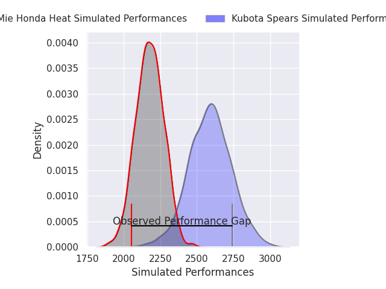
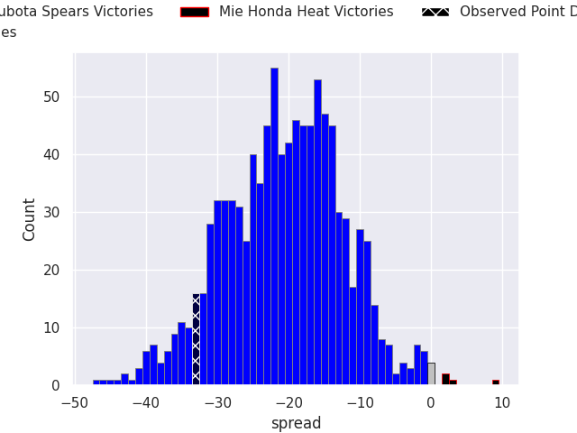
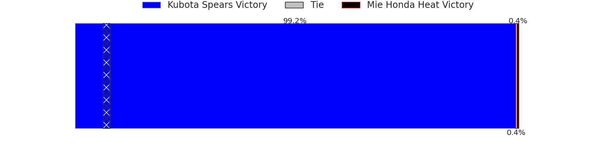
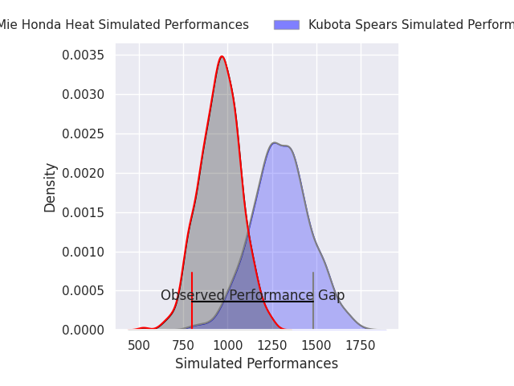
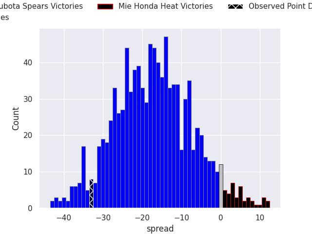
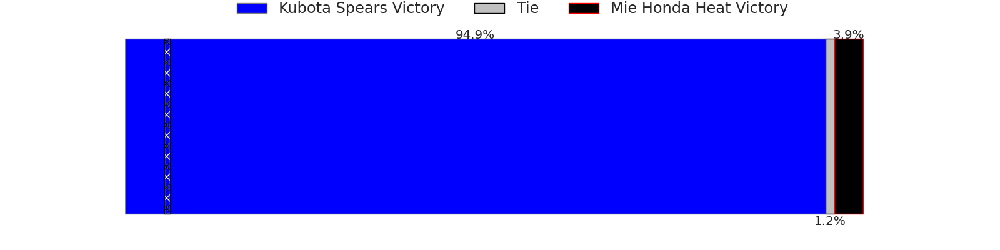

# Kubota Spears V Mie Honda Heat on 2026/04/25, 54.0 to 21.0

# Club Level Predictions

Now that the game has been played, lets see how the club predictions did. I predicted Kubota Spears to win by 20.61, and Kubota Spears won by 33.0. That's an absolute error of 12.4 for the margin of victory, while my average absolute error has been 13.9 over the past six months. This prediction was more accurate than 43.2% of my recent predictions.

For the Over/Under model, I predicted a total of 49.5 and we have an actual total of 75.0. That's an absolute error of 25.5 compared to a six month average of 13.5. This prediction was more accurate than 14.8% of my recent predictions.
## Projected Performances - Club Model

## Projected Spreads - Club Model

## Projected Results - Club Model

# Player Level Predictions

With the player model, I predicted Kubota Spears to win by 17.23,  and Kubota Spears won by 33.0. That's an absolute error of 15.8 for the margin of victory, while the average error as been 14.0 for the past six months. So this prediction was more accurate than 28.6% of my recent predictions.
## Projected Performances - Player Model

## Projected Spreads - Player Model

## Projected Results - Player Model

