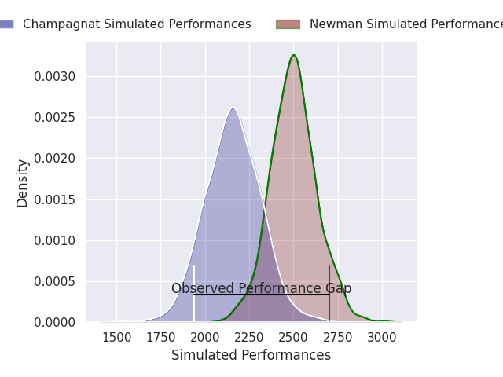
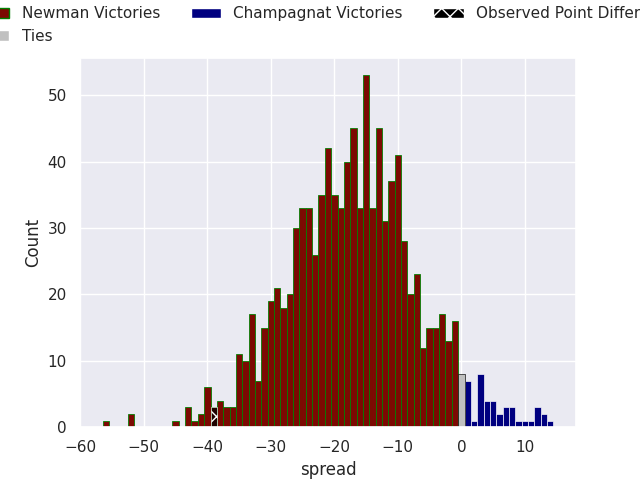
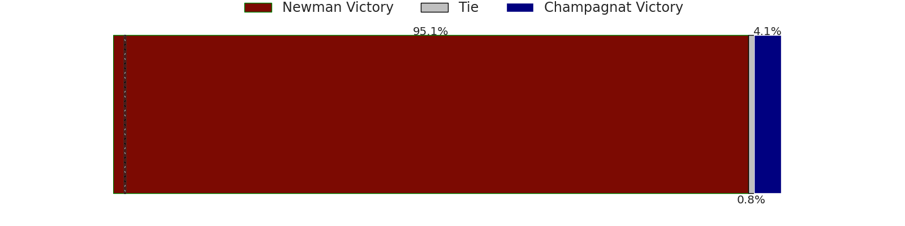

# Newman V Champagnat on 2026/04/25, 47.0 to 8.0

# Club Level Predictions

Now that the game has been played, lets see how the club predictions did. I predicted Newman to win by 17.04, and Newman won by 39.0. That's an absolute error of 22.0 for the margin of victory, while my average absolute error has been 14.0 over the past six months. This prediction was more accurate than 21.0% of my recent predictions.

For the Over/Under model, I predicted a total of 49.5 and we have an actual total of 55.0. That's an absolute error of 5.5 compared to a six month average of 13.6. This prediction was more accurate than 74.5% of my recent predictions.
## Projected Performances - Club Model

## Projected Spreads - Club Model

## Projected Results - Club Model

