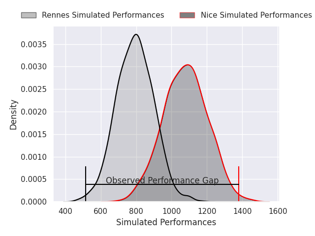
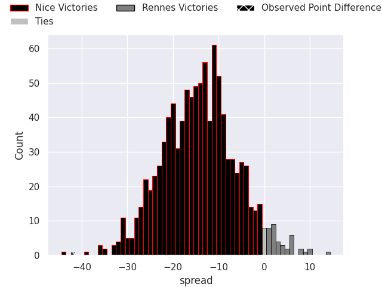
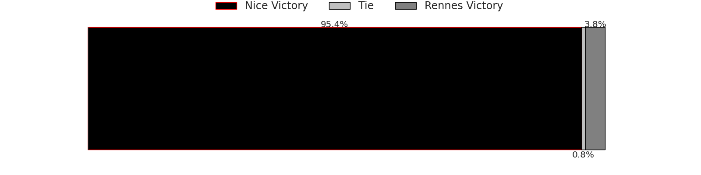

# Nice V Rennes on 2026/04/25, 47.0 to 5.0

# Club Level Predictions

Now that the game has been played, lets see how the club predictions did. I predicted Nice to win by 14.65, and Nice won by 42.0. That's an absolute error of 27.4 for the margin of victory, while my average absolute error has been 14.0 over the past six months. This prediction was more accurate than 13.5% of my recent predictions.

For the Over/Under model, I predicted a total of 40.5 and we have an actual total of 52.0. That's an absolute error of 11.5 compared to a six month average of 13.6. This prediction was more accurate than 48.8% of my recent predictions.
## Projected Performances - Club Model

## Projected Spreads - Club Model

## Projected Results - Club Model

# Player Level Predictions

With the player model, I predicted Nice to win by 14.22,  and Nice won by 42.0. That's an absolute error of 27.8 for the margin of victory, while the average error as been 14.0 for the past six months. So this prediction was more accurate than 11.4% of my recent predictions.
## Projected Performances - Player Model

## Projected Spreads - Player Model

## Projected Results - Player Model

