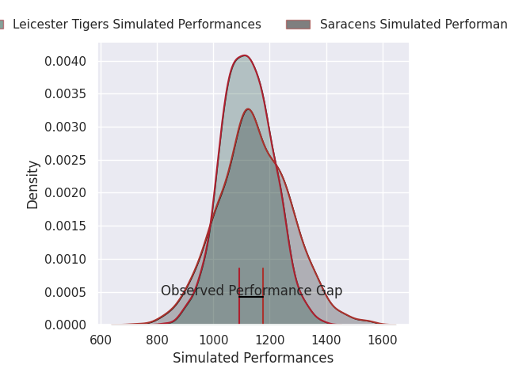
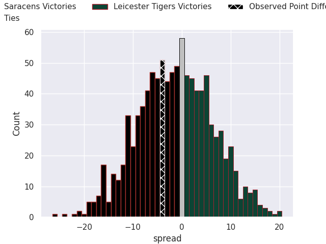

# Saracens V Leicester Tigers on 2026/04/25, 19.0 to 15.0

# Club Level Predictions

Now that the game has been played, lets see how the club predictions did. I predicted Leicester Tigers to win by 0.05, and Saracens won by 4.0. That's an absolute error of 4.0 for the margin of victory, while my average absolute error has been 14.0 over the past six months. This prediction was more accurate than 80.0% of my recent predictions.

For the Over/Under model, I predicted a total of 50.5 and we have an actual total of 34.0. That's an absolute error of 16.5 compared to a six month average of 13.6. This prediction was more accurate than 32.2% of my recent predictions.
## Projected Performances - Club Model

## Projected Spreads - Club Model

## Projected Results - Club Model

# Player Level Predictions

With the player model, I predicted Saracens to win by 1.33,  and Saracens won by 4.0. That's an absolute error of 2.7 for the margin of victory, while the average error as been 14.0 for the past six months. So this prediction was more accurate than 77.4% of my recent predictions.
## Projected Performances - Player Model

## Projected Spreads - Player Model

## Projected Results - Player Model

