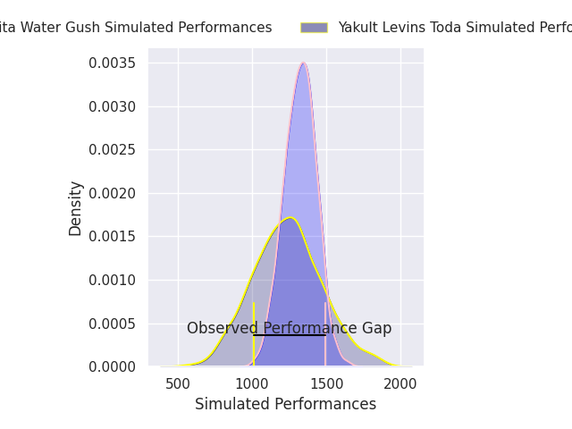
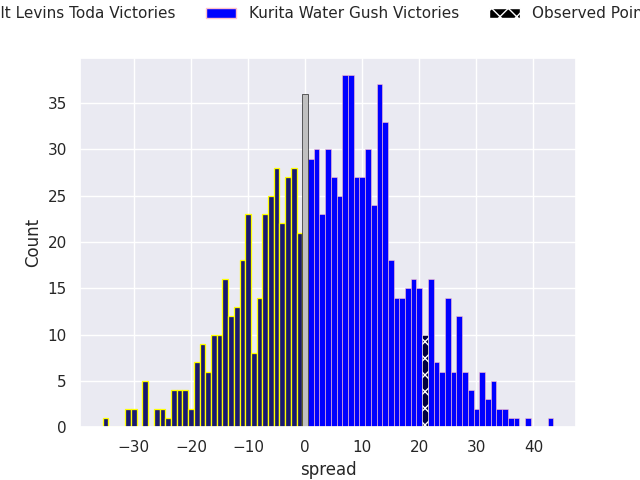
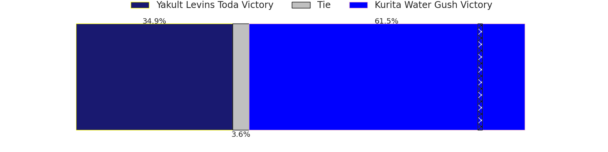

# Yakult Levins Toda V Kurita Water Gush on 2026/04/25, 17.0 to 38.0

# Club Level Predictions

Now that the game has been played, lets see how the club predictions did. I predicted Kurita Water Gush to win by 4.32, and Kurita Water Gush won by 21.0. That's an absolute error of 16.7 for the margin of victory, while my average absolute error has been 14.0 over the past six months. This prediction was more accurate than 31.4% of my recent predictions.

For the Over/Under model, I predicted a total of 53.5 and we have an actual total of 55.0. That's an absolute error of 1.5 compared to a six month average of 13.6. This prediction was more accurate than 93.0% of my recent predictions.
## Projected Performances - Club Model

## Projected Spreads - Club Model

## Projected Results - Club Model

