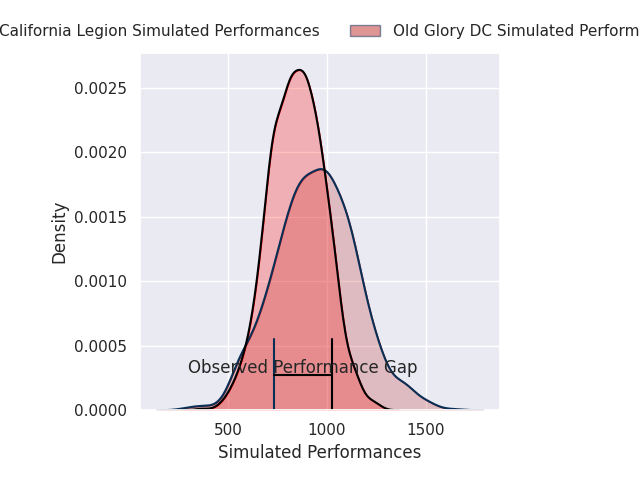
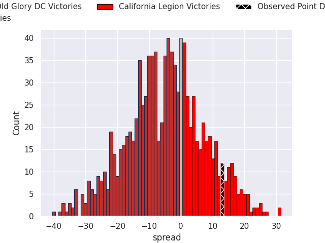
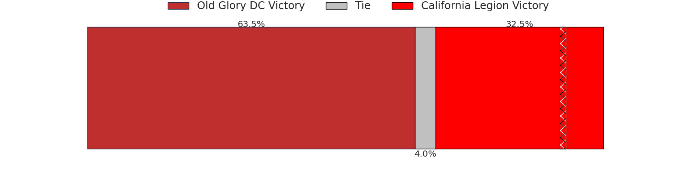

# Old Glory DC V California Legion on 2026/04/26, 23.0 to 36.0

# Club Level Predictions

Now that the game has been played, lets see how the club predictions did. I predicted Old Glory DC to win by 30.6, and California Legion won by 13.0. That's an absolute error of 43.6 for the margin of victory, while my average absolute error has been 13.9 over the past six months. This prediction was more accurate than 3.0% of my recent predictions.

For the Over/Under model, I predicted a total of 52.5 and we have an actual total of 59.0. That's an absolute error of 6.5 compared to a six month average of 13.5. This prediction was more accurate than 69.5% of my recent predictions.
## Projected Performances - Club Model

## Projected Spreads - Club Model

## Projected Results - Club Model

# Player Level Predictions

With the player model, I predicted Old Glory DC to win by 4.85,  and California Legion won by 13.0. That's an absolute error of 17.8 for the margin of victory, while the average error as been 14.0 for the past six months. So this prediction was more accurate than 24.3% of my recent predictions.
## Projected Performances - Player Model

## Projected Spreads - Player Model

## Projected Results - Player Model

