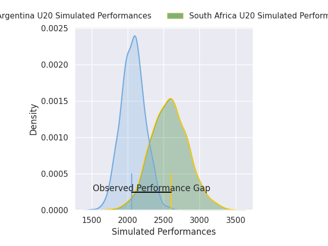
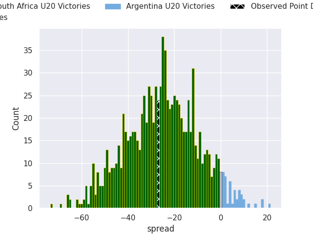

# South Africa U20 V Argentina U20 on 2026/04/27, 48.0 to 21.0

# Club Level Predictions

Now that the game has been played, lets see how the club predictions did. I predicted South Africa U20 to win by 25.36, and South Africa U20 won by 27.0. That's an absolute error of 1.6 for the margin of victory, while my average absolute error has been 13.9 over the past six months. This prediction was more accurate than 90.9% of my recent predictions.

For the Over/Under model, I predicted a total of 54.5 and we have an actual total of 69.0. That's an absolute error of 14.5 compared to a six month average of 13.5. This prediction was more accurate than 38.2% of my recent predictions.
## Projected Performances - Club Model

## Projected Spreads - Club Model

## Projected Results - Club Model

