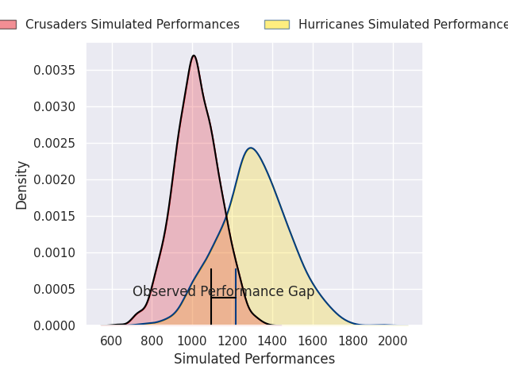
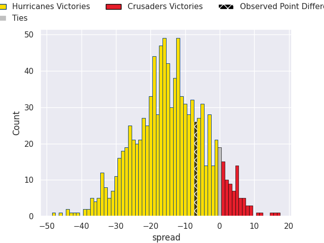
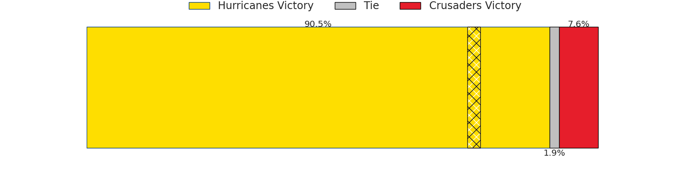

# Hurricanes V Crusaders on 2026/05/01, 38.0 to 31.0

# Club Level Predictions

Now that the game has been played, lets see how the club predictions did. I predicted Hurricanes to win by 12.57, and Hurricanes won by 7.0. That's an absolute error of 5.6 for the margin of victory, while my average absolute error has been 13.9 over the past six months. This prediction was more accurate than 71.7% of my recent predictions.

For the Over/Under model, I predicted a total of 49.5 and we have an actual total of 69.0. That's an absolute error of 19.5 compared to a six month average of 13.4. This prediction was more accurate than 24.7% of my recent predictions.
## Projected Performances - Club Model

## Projected Spreads - Club Model

## Projected Results - Club Model

# Player Level Predictions

With the player model, I predicted Hurricanes to win by 14.32,  and Hurricanes won by 7.0. That's an absolute error of 7.3 for the margin of victory, while the average error as been 13.8 for the past six months. So this prediction was more accurate than 56.1% of my recent predictions.
## Projected Performances - Player Model

## Projected Spreads - Player Model

## Projected Results - Player Model

