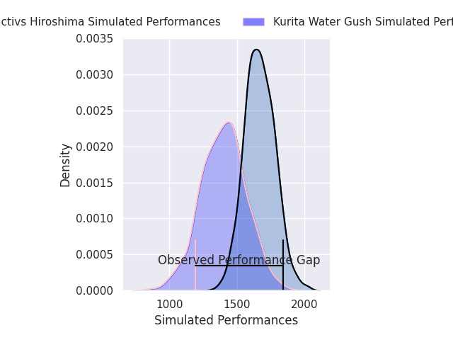
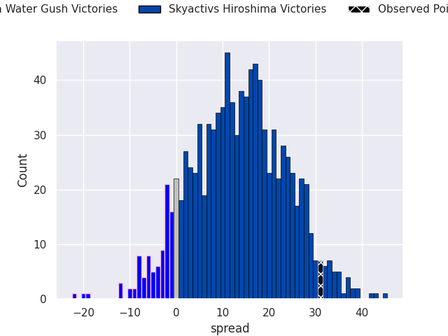
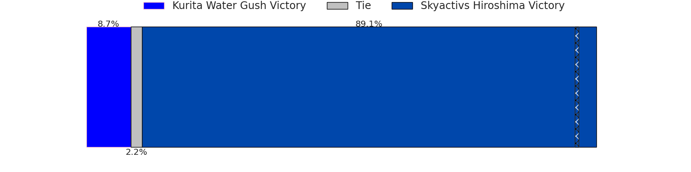

# Kurita Water Gush V Skyactivs Hiroshima on 2026/05/01, 13.0 to 44.0

# Club Level Predictions

Now that the game has been played, lets see how the club predictions did. I predicted Skyactivs Hiroshima to win by 13.42, and Skyactivs Hiroshima won by 31.0. That's an absolute error of 17.6 for the margin of victory, while my average absolute error has been 13.9 over the past six months. This prediction was more accurate than 28.3% of my recent predictions.

For the Over/Under model, I predicted a total of 53.5 and we have an actual total of 57.0. That's an absolute error of 3.5 compared to a six month average of 13.4. This prediction was more accurate than 84.0% of my recent predictions.
## Projected Performances - Club Model

## Projected Spreads - Club Model

## Projected Results - Club Model

