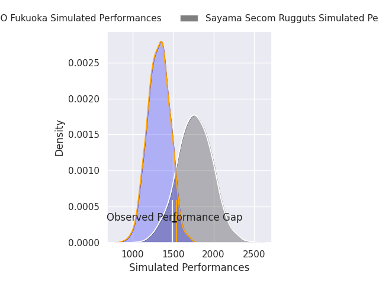
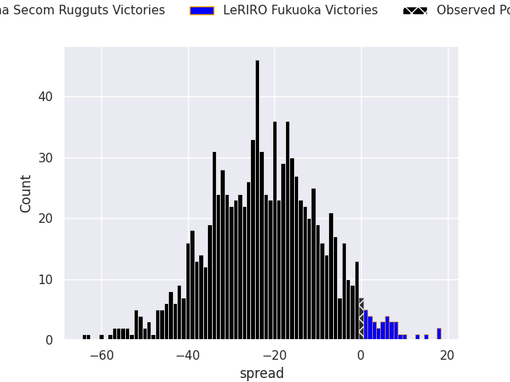
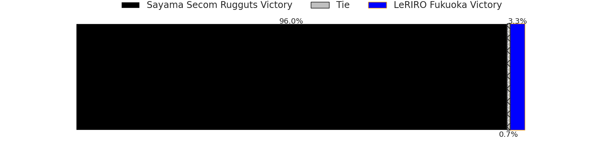
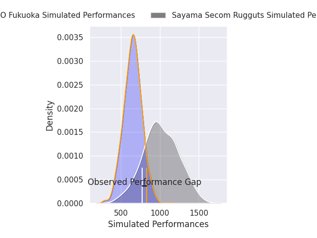
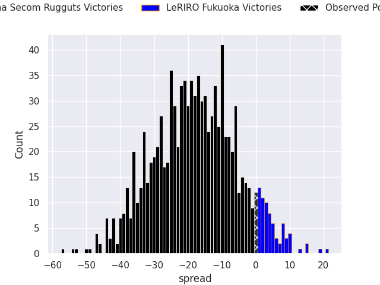

# Sayama Secom Rugguts V LeRIRO Fukuoka on 2026/05/01, 31.0 to 31.0

# Club Level Predictions

Now that the game has been played, lets see how the club predictions did. I predicted Sayama Secom Rugguts to win by 22.33, and LeRIRO Fukuoka won by 0.0. That's an absolute error of 22.3 for the margin of victory, while my average absolute error has been 13.9 over the past six months. This prediction was more accurate than 20.0% of my recent predictions.

For the Over/Under model, I predicted a total of 50.5 and we have an actual total of 62.0. That's an absolute error of 11.5 compared to a six month average of 13.5. This prediction was more accurate than 48.7% of my recent predictions.
## Projected Performances - Club Model

## Projected Spreads - Club Model

## Projected Results - Club Model

# Player Level Predictions

With the player model, I predicted Sayama Secom Rugguts to win by 18.03,  and LeRIRO Fukuoka won by 0.0. That's an absolute error of 18.0 for the margin of victory, while the average error as been 14.0 for the past six months. So this prediction was more accurate than 23.9% of my recent predictions.
## Projected Performances - Player Model

## Projected Spreads - Player Model

## Projected Results - Player Model

