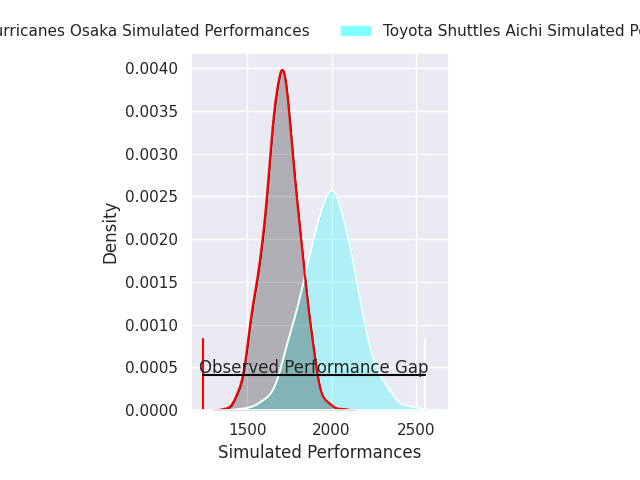
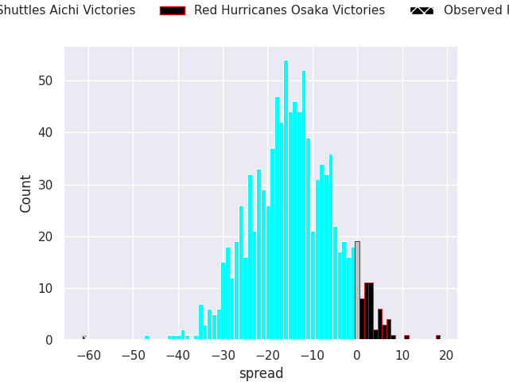
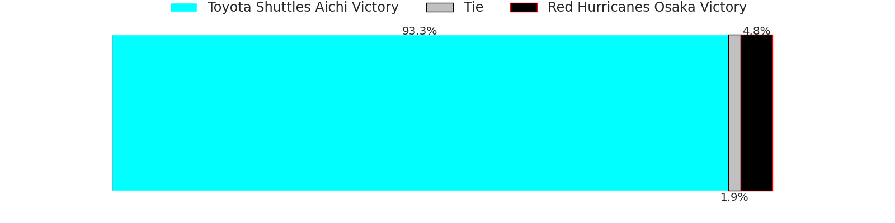
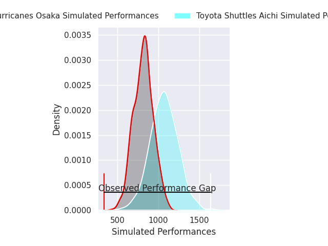
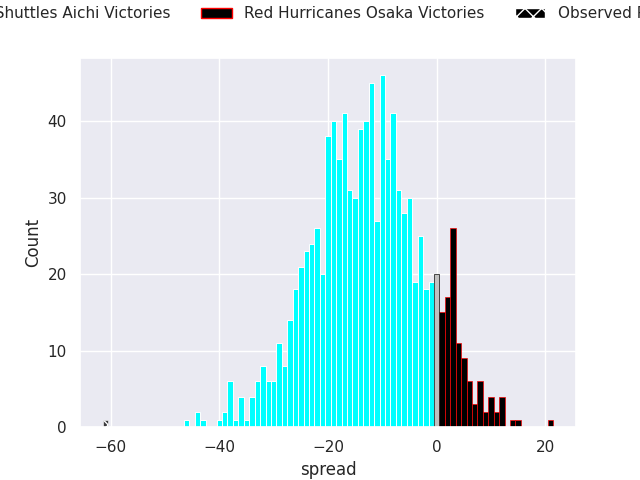
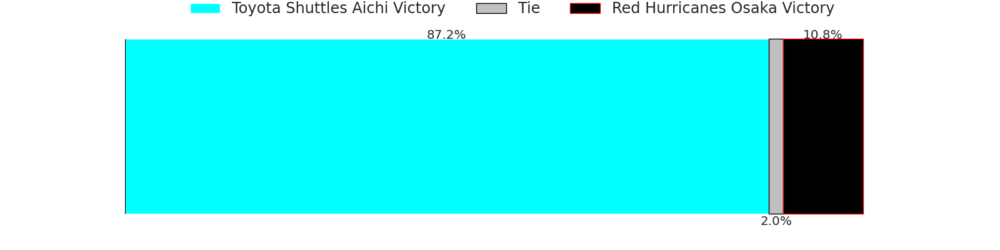

# Toyota Shuttles Aichi V Red Hurricanes Osaka on 2026/05/01, 78.0 to 17.0

# Club Level Predictions

Now that the game has been played, lets see how the club predictions did. I predicted Toyota Shuttles Aichi to win by 14.57, and Toyota Shuttles Aichi won by 61.0. That's an absolute error of 46.4 for the margin of victory, while my average absolute error has been 13.9 over the past six months. This prediction was more accurate than 2.2% of my recent predictions.

For the Over/Under model, I predicted a total of 47.5 and we have an actual total of 95.0. That's an absolute error of 47.5 compared to a six month average of 13.4. This prediction was more accurate than 0.4% of my recent predictions.
## Projected Performances - Club Model

## Projected Spreads - Club Model

## Projected Results - Club Model

# Player Level Predictions

With the player model, I predicted Toyota Shuttles Aichi to win by 12.75,  and Toyota Shuttles Aichi won by 61.0. That's an absolute error of 48.2 for the margin of victory, while the average error as been 13.8 for the past six months. So this prediction was more accurate than 1.4% of my recent predictions.
## Projected Performances - Player Model

## Projected Spreads - Player Model

## Projected Results - Player Model

