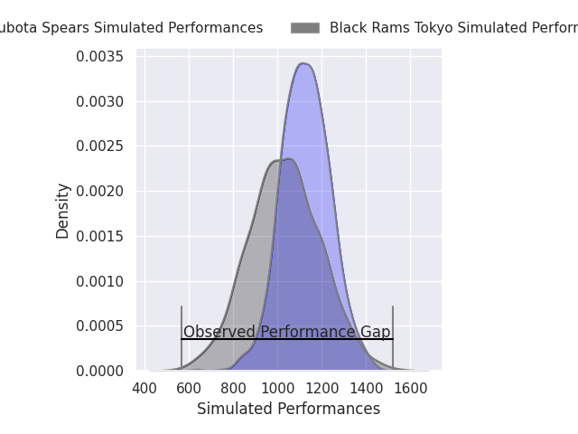
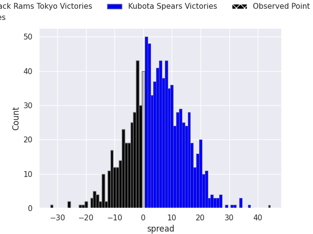
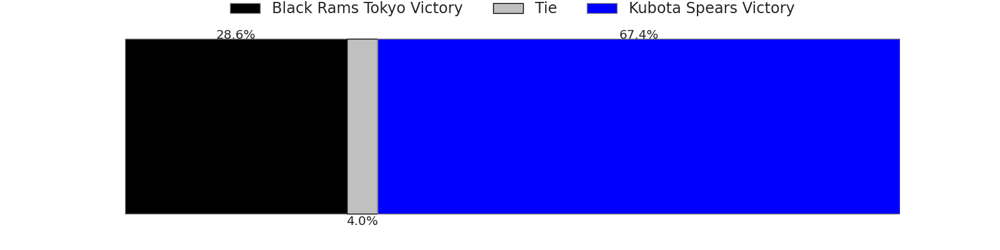

# Black Rams Tokyo V Kubota Spears on 2026/05/02, 8.0 to 52.0

# Club Level Predictions

Now that the game has been played, lets see how the club predictions did. I predicted Kubota Spears to win by 7.97, and Kubota Spears won by 44.0. That's an absolute error of 36.0 for the margin of victory, while my average absolute error has been 13.9 over the past six months. This prediction was more accurate than 6.3% of my recent predictions.

For the Over/Under model, I predicted a total of 50.5 and we have an actual total of 60.0. That's an absolute error of 9.5 compared to a six month average of 13.4. This prediction was more accurate than 55.8% of my recent predictions.
## Projected Performances - Club Model

## Projected Spreads - Club Model

## Projected Results - Club Model

# Player Level Predictions

With the player model, I predicted Kubota Spears to win by 4.73,  and Kubota Spears won by 44.0. That's an absolute error of 39.3 for the margin of victory, while the average error as been 13.8 for the past six months. So this prediction was more accurate than 4.2% of my recent predictions.
## Projected Performances - Player Model

## Projected Spreads - Player Model

## Projected Results - Player Model

