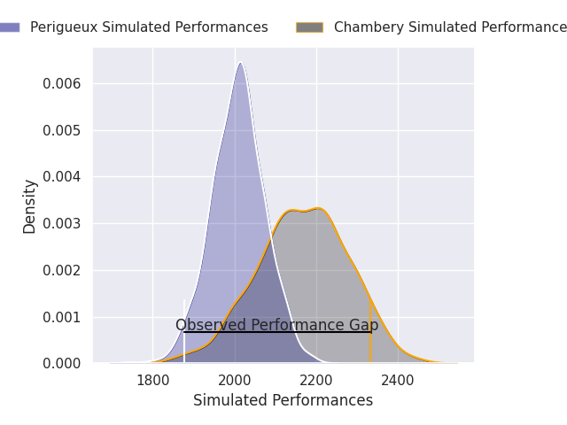
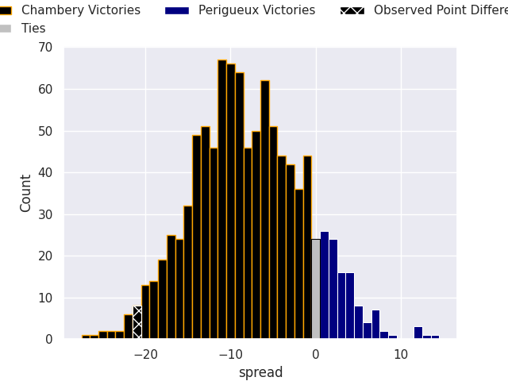
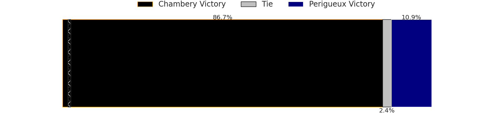
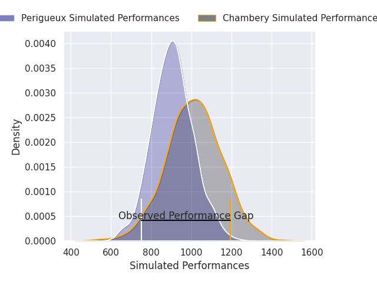
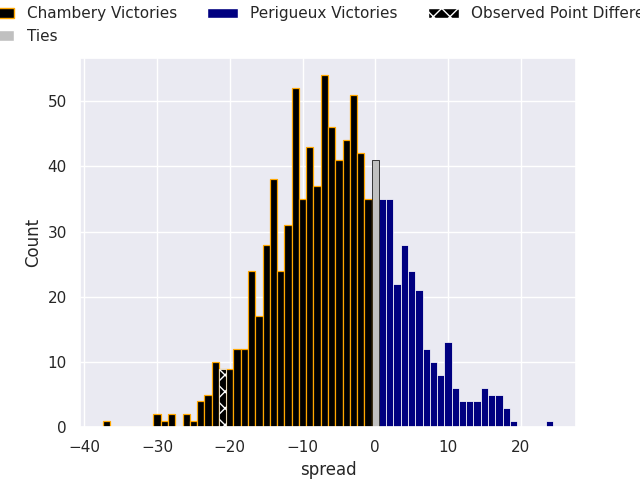
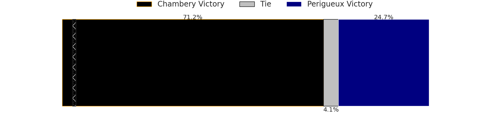

# Chambery V Périgueux on 2026/05/02, 34.0 to 13.0

# Club Level Predictions

Now that the game has been played, lets see how the club predictions did. I predicted Chambery to win by 7.9, and Chambery won by 21.0. That's an absolute error of 13.1 for the margin of victory, while my average absolute error has been 13.9 over the past six months. This prediction was more accurate than 41.3% of my recent predictions.

For the Over/Under model, I predicted a total of 44.5 and we have an actual total of 47.0. That's an absolute error of 2.5 compared to a six month average of 13.4. This prediction was more accurate than 88.7% of my recent predictions.
## Projected Performances - Club Model

## Projected Spreads - Club Model

## Projected Results - Club Model

# Player Level Predictions

With the player model, I predicted Chambery to win by 5.26,  and Chambery won by 21.0. That's an absolute error of 15.7 for the margin of victory, while the average error as been 13.8 for the past six months. So this prediction was more accurate than 28.1% of my recent predictions.
## Projected Performances - Player Model

## Projected Spreads - Player Model

## Projected Results - Player Model

