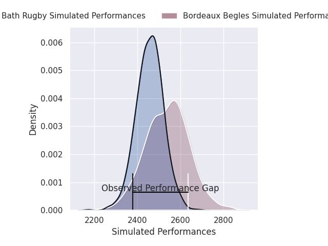
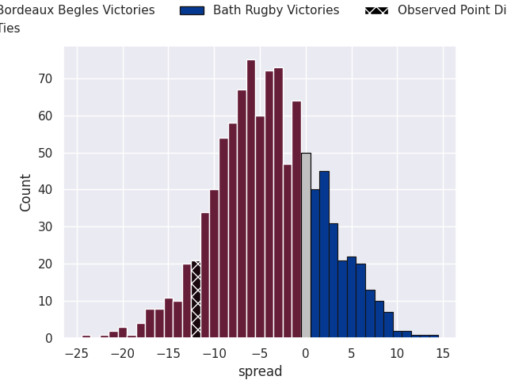
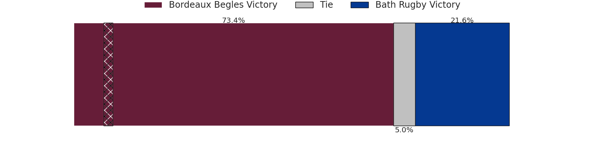

# Bordeaux-Begles V Bath Rugby on 2026/05/03, 38.0 to 26.0

# Club Level Predictions

Now that the game has been played, lets see how the club predictions did. I predicted Bordeaux Begles to win by 4.08, and Bordeaux Begles won by 12.0. That's an absolute error of 7.9 for the margin of victory, while my average absolute error has been 13.9 over the past six months. This prediction was more accurate than 60.9% of my recent predictions.

For the Over/Under model, I predicted a total of 50.5 and we have an actual total of 64.0. That's an absolute error of 13.5 compared to a six month average of 13.4. This prediction was more accurate than 40.3% of my recent predictions.
## Projected Performances - Club Model

## Projected Spreads - Club Model

## Projected Results - Club Model

