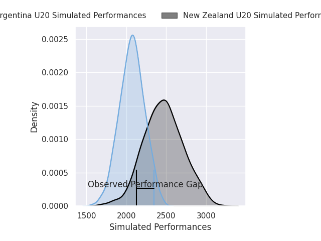
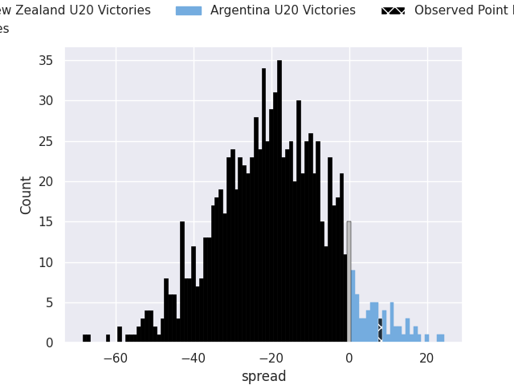
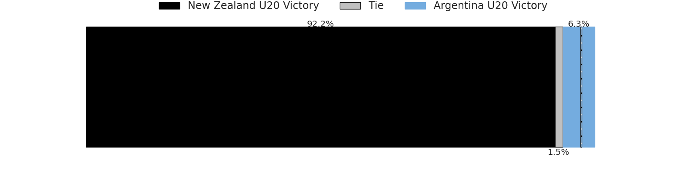

# New Zealand U20 V Argentina U20 on 2026/05/03, 17.0 to 25.0

# Club Level Predictions

Now that the game has been played, lets see how the club predictions did. I predicted New Zealand U20 to win by 19.78, and Argentina U20 won by 8.0. That's an absolute error of 27.8 for the margin of victory, while my average absolute error has been 13.9 over the past six months. This prediction was more accurate than 12.5% of my recent predictions.

For the Over/Under model, I predicted a total of 55.5 and we have an actual total of 42.0. That's an absolute error of 13.5 compared to a six month average of 13.4. This prediction was more accurate than 40.3% of my recent predictions.
## Projected Performances - Club Model

## Projected Spreads - Club Model

## Projected Results - Club Model

