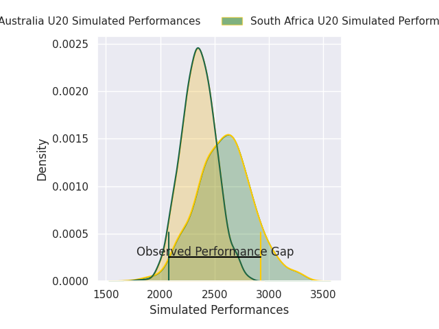
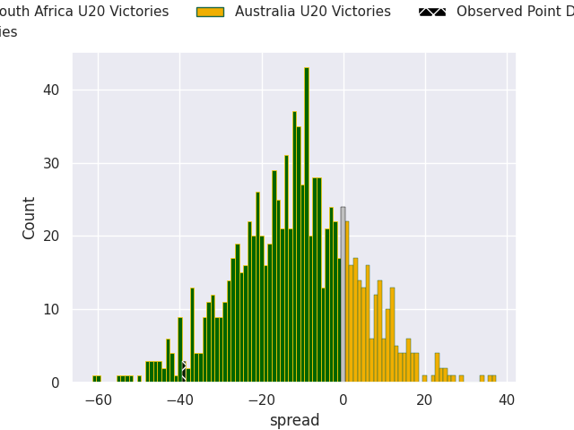
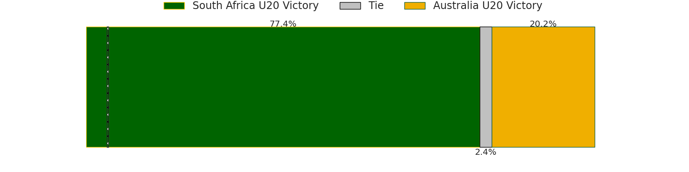

# South Africa U20 V Australia U20 on 2026/05/03, 56.0 to 17.0

# Club Level Predictions

Now that the game has been played, lets see how the club predictions did. I predicted South Africa U20 to win by 11.84, and South Africa U20 won by 39.0. That's an absolute error of 27.2 for the margin of victory, while my average absolute error has been 13.9 over the past six months. This prediction was more accurate than 13.5% of my recent predictions.

For the Over/Under model, I predicted a total of 54.5 and we have an actual total of 73.0. That's an absolute error of 18.5 compared to a six month average of 13.4. This prediction was more accurate than 27.5% of my recent predictions.
## Projected Performances - Club Model

## Projected Spreads - Club Model

## Projected Results - Club Model

