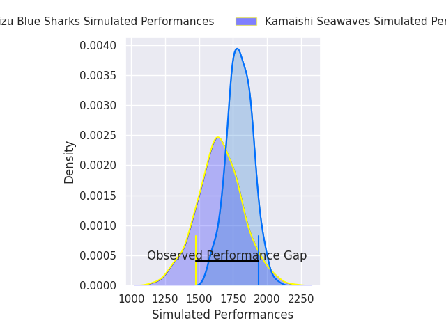
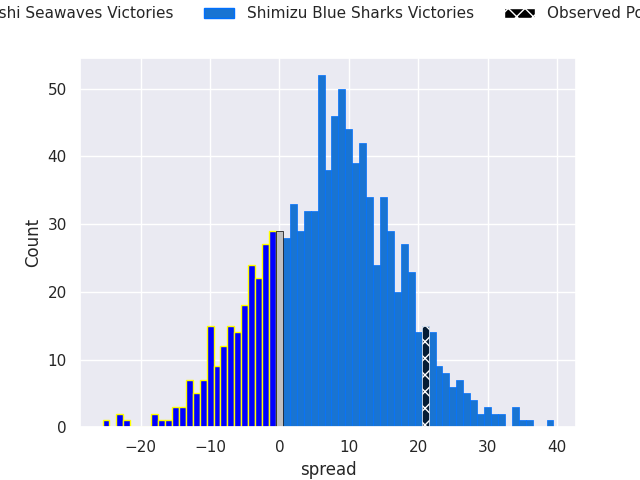
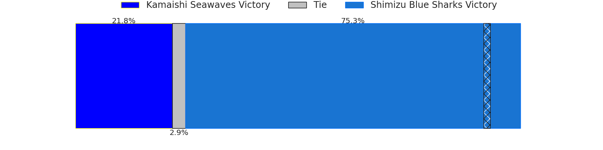
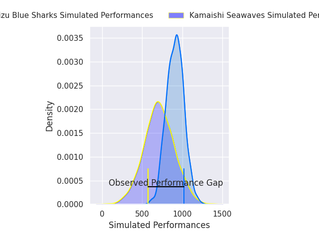
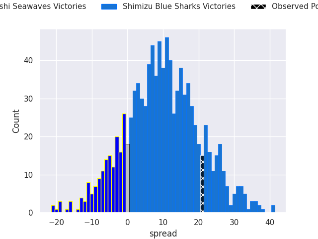
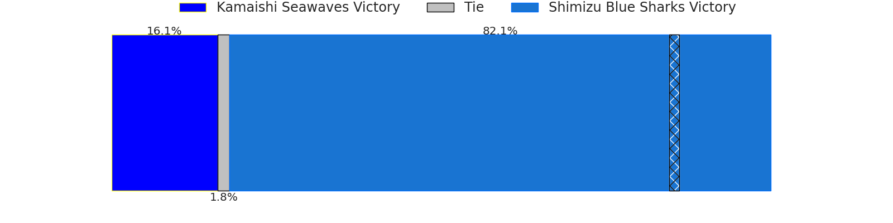

# Kamaishi Seawaves V Shimizu Blue Sharks on 2026/05/08, 10.0 to 31.0

# Club Level Predictions

Now that the game has been played, lets see how the club predictions did. I predicted Shimizu Blue Sharks to win by 7.29, and Shimizu Blue Sharks won by 21.0. That's an absolute error of 13.7 for the margin of victory, while my average absolute error has been 13.8 over the past six months. This prediction was more accurate than 39.3% of my recent predictions.

For the Over/Under model, I predicted a total of 55.5 and we have an actual total of 41.0. That's an absolute error of 14.5 compared to a six month average of 13.4. This prediction was more accurate than 37.6% of my recent predictions.
## Projected Performances - Club Model

## Projected Spreads - Club Model

## Projected Results - Club Model

# Player Level Predictions

With the player model, I predicted Shimizu Blue Sharks to win by 9.87,  and Shimizu Blue Sharks won by 21.0. That's an absolute error of 11.1 for the margin of victory, while the average error as been 13.8 for the past six months. So this prediction was more accurate than 41.4% of my recent predictions.
## Projected Performances - Player Model

## Projected Spreads - Player Model

## Projected Results - Player Model

