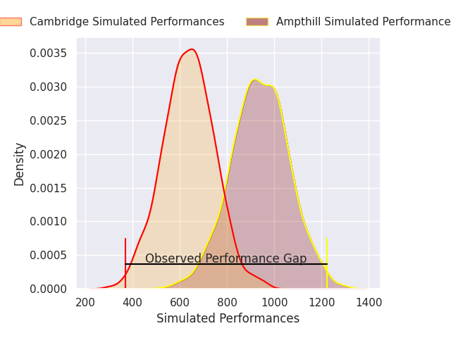
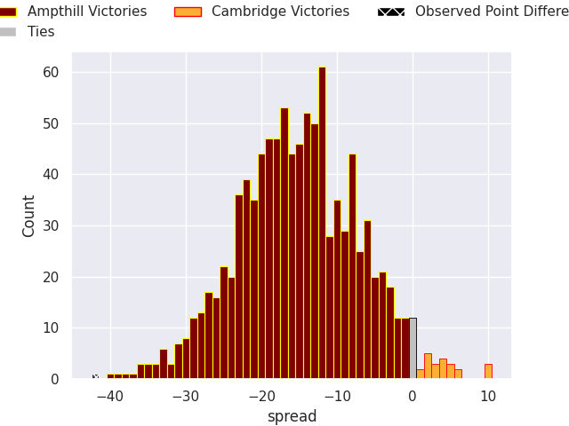
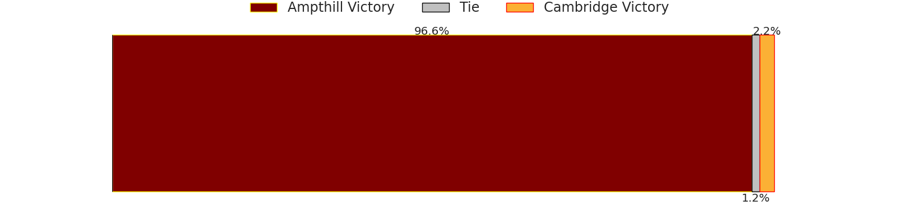

# Ampthill V Cambridge on 2026/05/09, 75.0 to 33.0

# Club Level Predictions

Now that the game has been played, lets see how the club predictions did. I predicted Ampthill to win by 21.25, and Ampthill won by 42.0. That's an absolute error of 20.8 for the margin of victory, while my average absolute error has been 13.9 over the past six months. This prediction was more accurate than 22.4% of my recent predictions.

For the Over/Under model, I predicted a total of 50.5 and we have an actual total of 108.0. That's an absolute error of 57.5 compared to a six month average of 13.4. This prediction was more accurate than 0.2% of my recent predictions.
## Projected Performances - Club Model

## Projected Spreads - Club Model

## Projected Results - Club Model

# Player Level Predictions

With the player model, I predicted Ampthill to win by 15.09,  and Ampthill won by 42.0. That's an absolute error of 26.9 for the margin of victory, while the average error as been 13.8 for the past six months. So this prediction was more accurate than 11.3% of my recent predictions.
## Projected Performances - Player Model

## Projected Spreads - Player Model

## Projected Results - Player Model

