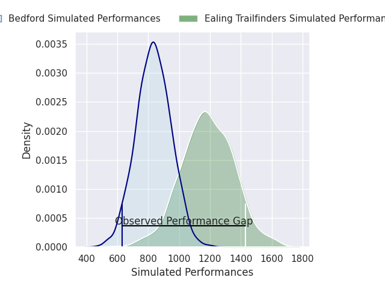
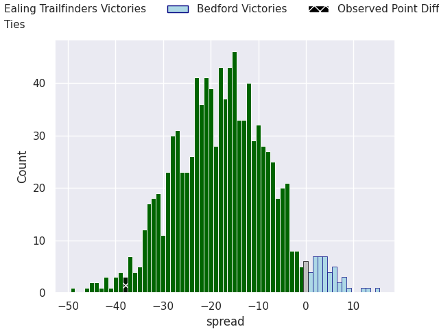
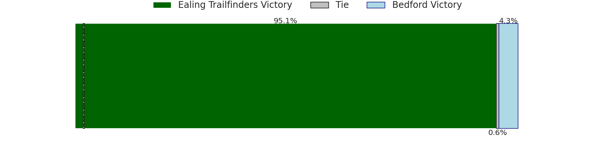

# Ealing Trailfinders V Bedford on 2026/05/09, 52.0 to 14.0

# Club Level Predictions

Now that the game has been played, lets see how the club predictions did. I predicted Ealing Trailfinders to win by 14.57, and Ealing Trailfinders won by 38.0. That's an absolute error of 23.4 for the margin of victory, while my average absolute error has been 13.9 over the past six months. This prediction was more accurate than 18.2% of my recent predictions.

For the Over/Under model, I predicted a total of 53.5 and we have an actual total of 66.0. That's an absolute error of 12.5 compared to a six month average of 13.5. This prediction was more accurate than 43.3% of my recent predictions.
## Projected Performances - Club Model

## Projected Spreads - Club Model

## Projected Results - Club Model

# Player Level Predictions

With the player model, I predicted Ealing Trailfinders to win by 17.53,  and Ealing Trailfinders won by 38.0. That's an absolute error of 20.5 for the margin of victory, while the average error as been 13.8 for the past six months. So this prediction was more accurate than 19.6% of my recent predictions.
## Projected Performances - Player Model

## Projected Spreads - Player Model

## Projected Results - Player Model

