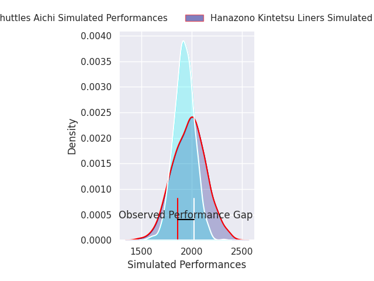
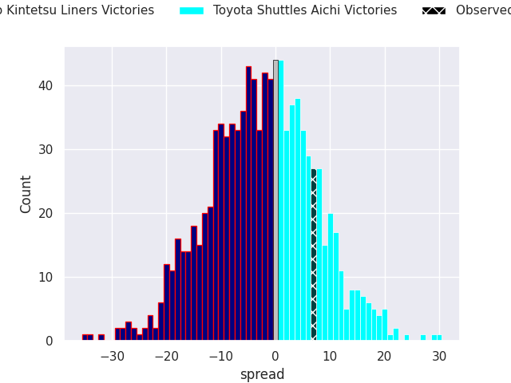
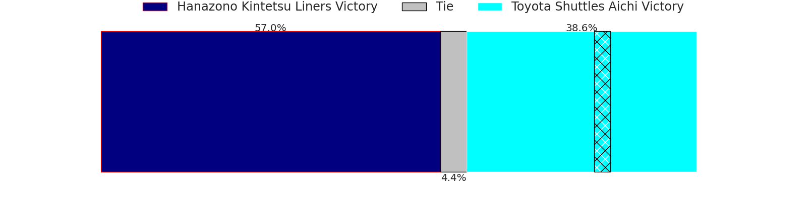
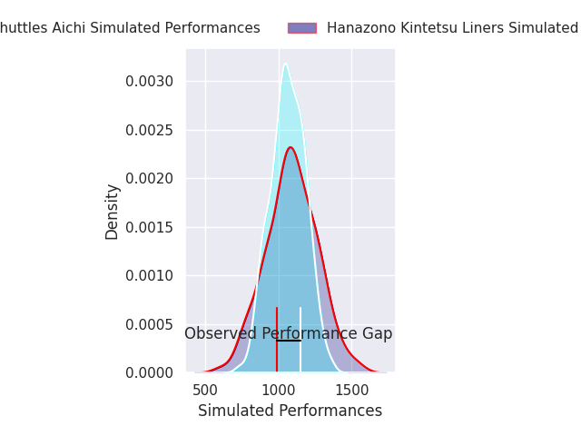
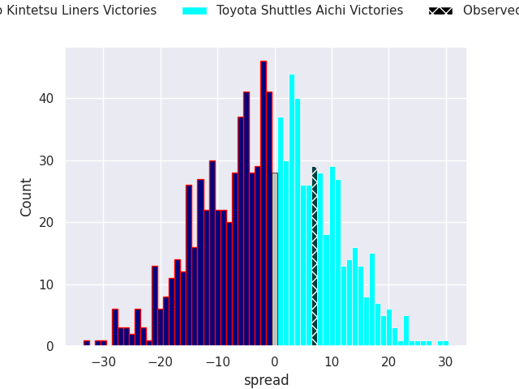
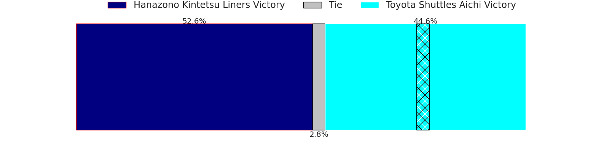

# Hanazono Kintetsu Liners V Toyota Shuttles Aichi on 2026/05/09, 27.0 to 34.0

# Club Level Predictions

Now that the game has been played, lets see how the club predictions did. I predicted Hanazono Kintetsu Liners to win by 2.46, and Toyota Shuttles Aichi won by 7.0. That's an absolute error of 9.5 for the margin of victory, while my average absolute error has been 13.9 over the past six months. This prediction was more accurate than 54.6% of my recent predictions.

For the Over/Under model, I predicted a total of 52.5 and we have an actual total of 61.0. That's an absolute error of 8.5 compared to a six month average of 13.4. This prediction was more accurate than 61.1% of my recent predictions.
## Projected Performances - Club Model

## Projected Spreads - Club Model

## Projected Results - Club Model

# Player Level Predictions

With the player model, I predicted Hanazono Kintetsu Liners to win by 1.28,  and Toyota Shuttles Aichi won by 7.0. That's an absolute error of 8.3 for the margin of victory, while the average error as been 13.8 for the past six months. So this prediction was more accurate than 52.0% of my recent predictions.
## Projected Performances - Player Model

## Projected Spreads - Player Model

## Projected Results - Player Model

