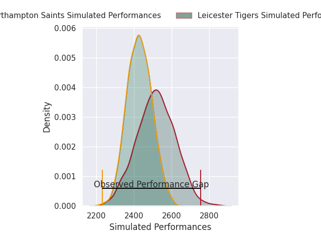
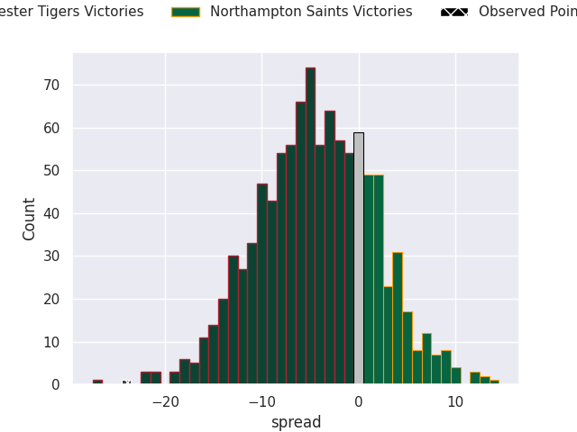
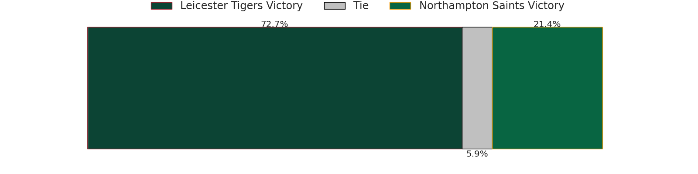
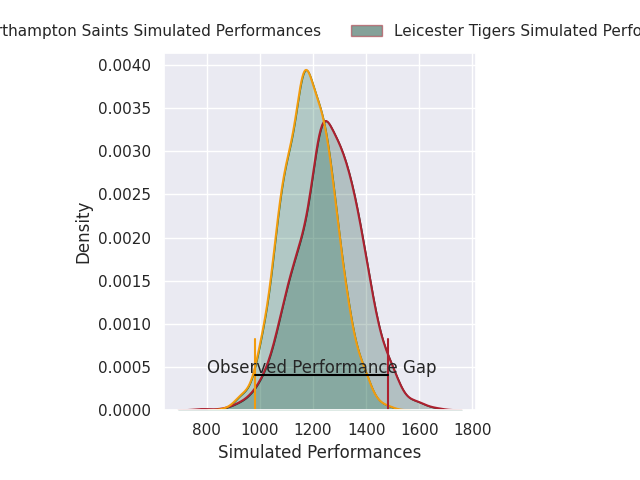
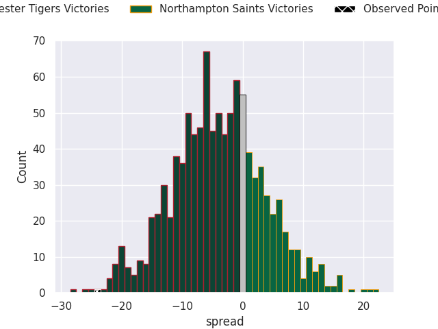
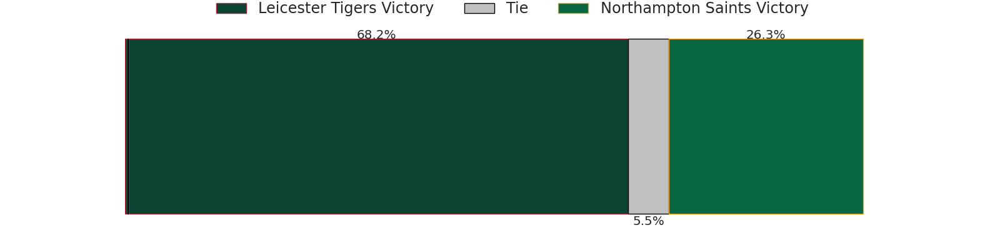

# Leicester Tigers V Northampton Saints on 2026/05/09, 41.0 to 17.0

# Club Level Predictions

Now that the game has been played, lets see how the club predictions did. I predicted Leicester Tigers to win by 4.38, and Leicester Tigers won by 24.0. That's an absolute error of 19.6 for the margin of victory, while my average absolute error has been 13.9 over the past six months. This prediction was more accurate than 25.1% of my recent predictions.

For the Over/Under model, I predicted a total of 51.5 and we have an actual total of 58.0. That's an absolute error of 6.5 compared to a six month average of 13.5. This prediction was more accurate than 69.2% of my recent predictions.
## Projected Performances - Club Model

## Projected Spreads - Club Model

## Projected Results - Club Model

# Player Level Predictions

With the player model, I predicted Leicester Tigers to win by 3.98,  and Leicester Tigers won by 24.0. That's an absolute error of 20.0 for the margin of victory, while the average error as been 13.8 for the past six months. So this prediction was more accurate than 20.8% of my recent predictions.
## Projected Performances - Player Model

## Projected Spreads - Player Model

## Projected Results - Player Model

