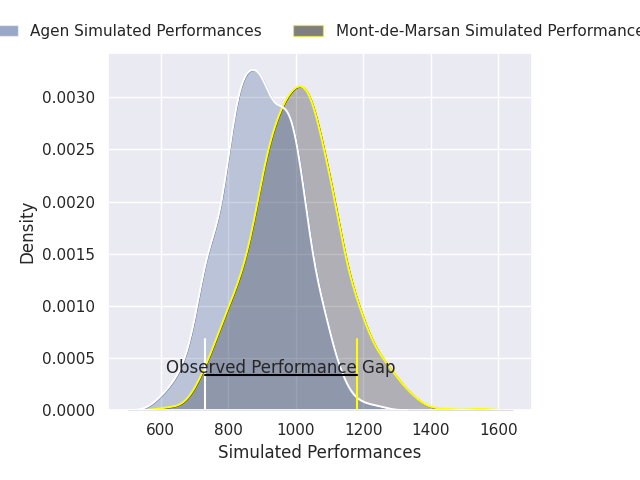
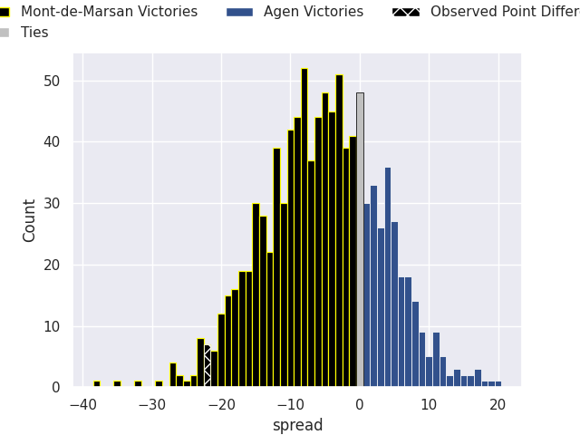
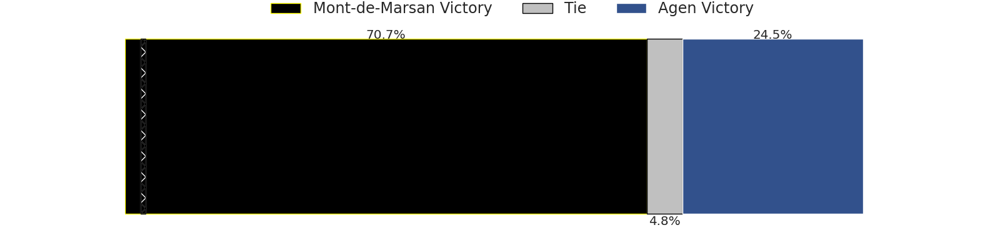

# Mont-de-Marsan V Agen on 2026/05/15, 50.0 to 28.0

# Club Level Predictions

Now that the game has been played, lets see how the club predictions did. I predicted Mont-de-Marsan to win by 1.73, and Mont-de-Marsan won by 22.0. That's an absolute error of 20.3 for the margin of victory, while my average absolute error has been 14.0 over the past six months. This prediction was more accurate than 24.0% of my recent predictions.

For the Over/Under model, I predicted a total of 48.5 and we have an actual total of 78.0. That's an absolute error of 29.5 compared to a six month average of 13.7. This prediction was more accurate than 9.1% of my recent predictions.
## Projected Performances - Club Model

## Projected Spreads - Club Model

## Projected Results - Club Model

# Player Level Predictions

With the player model, I predicted Mont-de-Marsan to win by 5.32,  and Mont-de-Marsan won by 22.0. That's an absolute error of 16.7 for the margin of victory, while the average error as been 13.9 for the past six months. So this prediction was more accurate than 26.2% of my recent predictions.
## Projected Performances - Player Model

## Projected Spreads - Player Model

## Projected Results - Player Model

