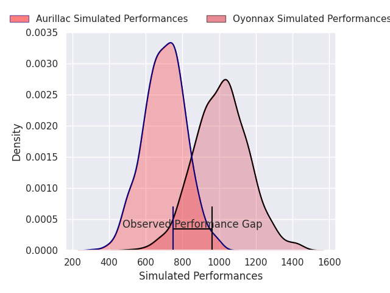
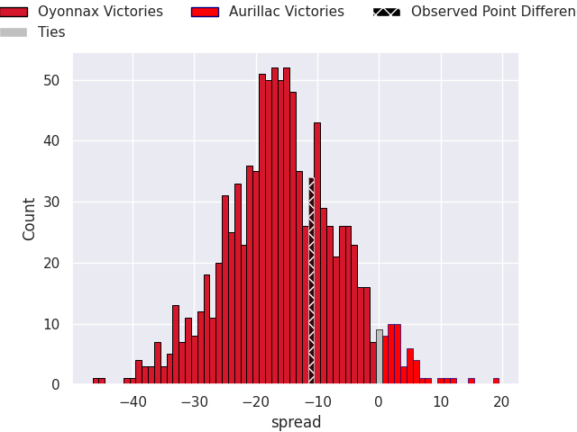
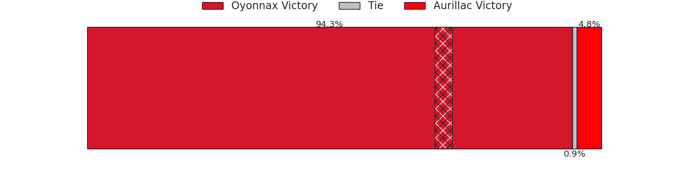

# Oyonnax V Aurillac on 2026/05/15, 36.0 to 25.0

# Club Level Predictions

Now that the game has been played, lets see how the club predictions did. I predicted Oyonnax to win by 17.37, and Oyonnax won by 11.0. That's an absolute error of 6.4 for the margin of victory, while my average absolute error has been 13.9 over the past six months. This prediction was more accurate than 67.8% of my recent predictions.

For the Over/Under model, I predicted a total of 49.5 and we have an actual total of 61.0. That's an absolute error of 11.5 compared to a six month average of 13.5. This prediction was more accurate than 48.0% of my recent predictions.
## Projected Performances - Club Model

## Projected Spreads - Club Model

## Projected Results - Club Model

# Player Level Predictions

With the player model, I predicted Oyonnax to win by 15.53,  and Oyonnax won by 11.0. That's an absolute error of 4.5 for the margin of victory, while the average error as been 13.9 for the past six months. So this prediction was more accurate than 67.6% of my recent predictions.
## Projected Performances - Player Model

## Projected Spreads - Player Model

## Projected Results - Player Model

