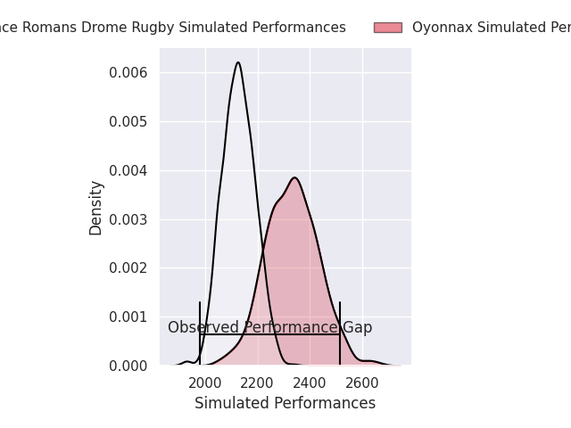
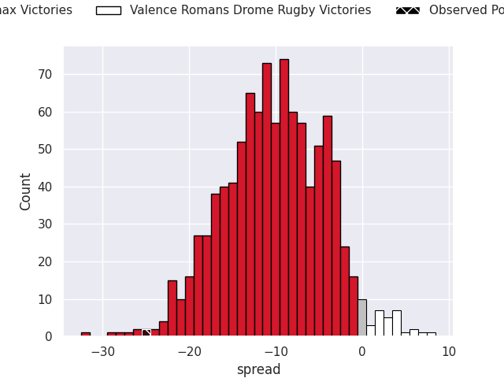
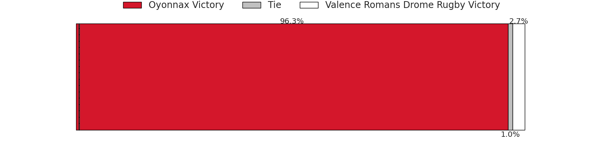
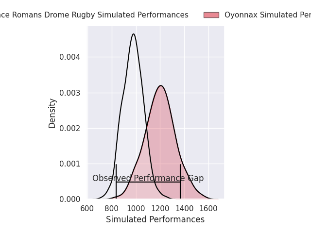
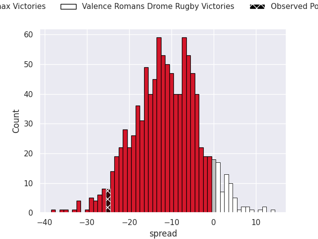
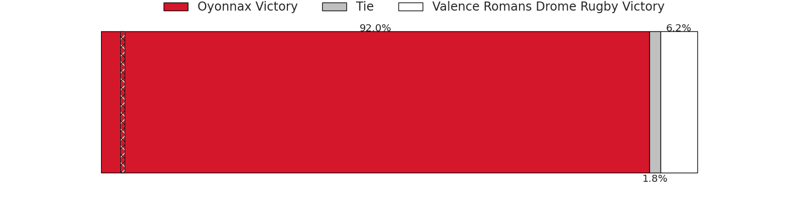

# Oyonnax V Valence Romans Drome Rugby on 2026/05/21, 39.0 to 14.0

# Club Level Predictions

Now that the game has been played, lets see how the club predictions did. I predicted Oyonnax to win by 10.17, and Oyonnax won by 25.0. That's an absolute error of 14.8 for the margin of victory, while my average absolute error has been 14.0 over the past six months. This prediction was more accurate than 37.1% of my recent predictions.

For the Over/Under model, I predicted a total of 48.5 and we have an actual total of 53.0. That's an absolute error of 4.5 compared to a six month average of 13.7. This prediction was more accurate than 79.1% of my recent predictions.
## Projected Performances - Club Model

## Projected Spreads - Club Model

## Projected Results - Club Model

# Player Level Predictions

With the player model, I predicted Oyonnax to win by 11.22,  and Oyonnax won by 25.0. That's an absolute error of 13.8 for the margin of victory, while the average error as been 13.8 for the past six months. So this prediction was more accurate than 32.9% of my recent predictions.
## Projected Performances - Player Model

## Projected Spreads - Player Model

## Projected Results - Player Model

