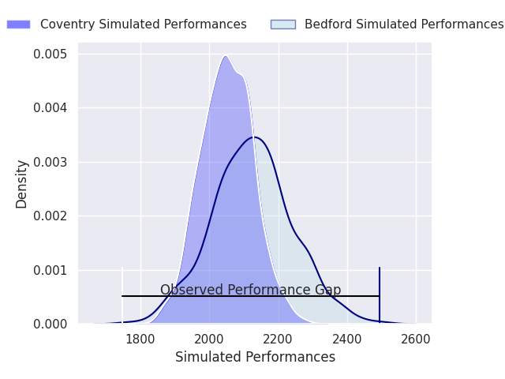
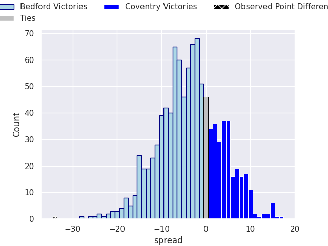

# Bedford V Coventry on 2026/05/22, 58.0 to 24.0

# Club Level Predictions

Now that the game has been played, lets see how the club predictions did. I predicted Bedford to win by 3.61, and Bedford won by 34.0. That's an absolute error of 30.4 for the margin of victory, while my average absolute error has been 14.0 over the past six months. This prediction was more accurate than 10.6% of my recent predictions.

For the Over/Under model, I predicted a total of 51.5 and we have an actual total of 82.0. That's an absolute error of 30.5 compared to a six month average of 13.7. This prediction was more accurate than 7.7% of my recent predictions.
## Projected Performances - Club Model

## Projected Spreads - Club Model

## Projected Results - Club Model

