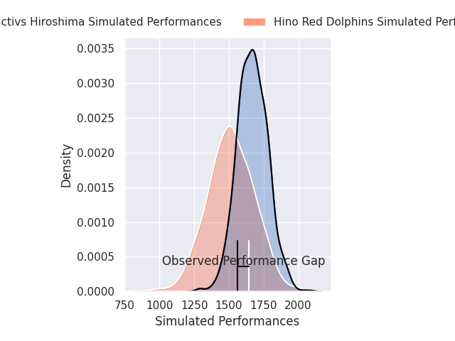
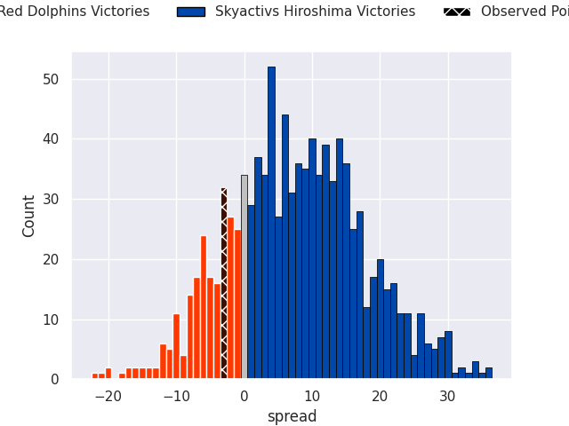
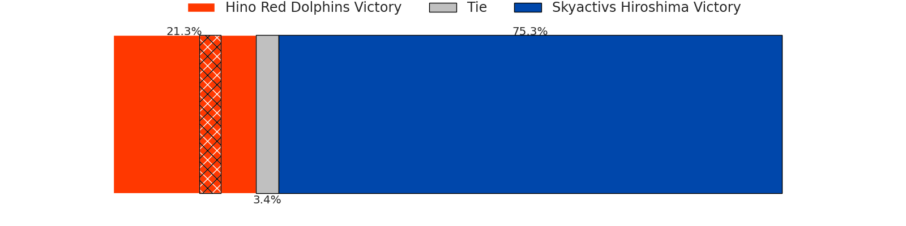
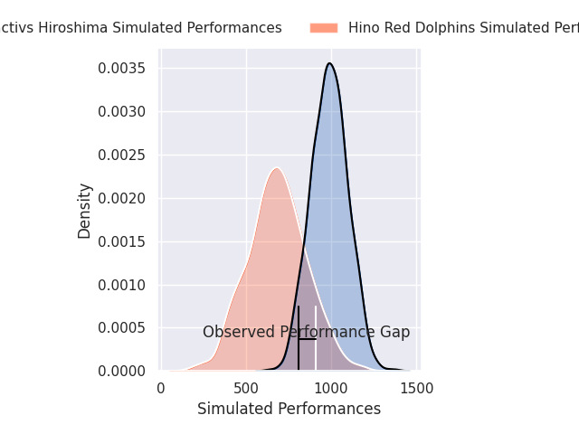
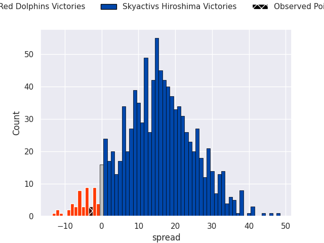
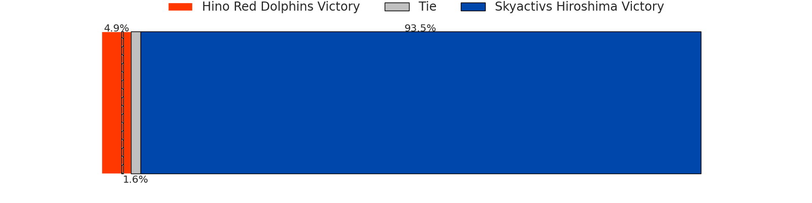

# Hino Red Dolphins V Skyactivs Hiroshima on 2026/05/22, 20.0 to 17.0

# Club Level Predictions

Now that the game has been played, lets see how the club predictions did. I predicted Skyactivs Hiroshima to win by 7.65, and Hino Red Dolphins won by 3.0. That's an absolute error of 10.6 for the margin of victory, while my average absolute error has been 14.1 over the past six months. This prediction was more accurate than 51.3% of my recent predictions.

For the Over/Under model, I predicted a total of 54.5 and we have an actual total of 37.0. That's an absolute error of 17.5 compared to a six month average of 13.7. This prediction was more accurate than 29.8% of my recent predictions.
## Projected Performances - Club Model

## Projected Spreads - Club Model

## Projected Results - Club Model

# Player Level Predictions

With the player model, I predicted Skyactivs Hiroshima to win by 15.3,  and Hino Red Dolphins won by 3.0. That's an absolute error of 18.3 for the margin of victory, while the average error as been 14.0 for the past six months. So this prediction was more accurate than 24.1% of my recent predictions.
## Projected Performances - Player Model

## Projected Spreads - Player Model

## Projected Results - Player Model

