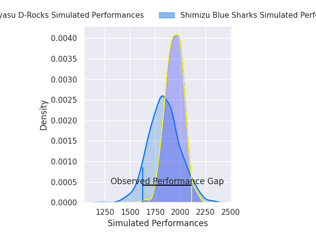
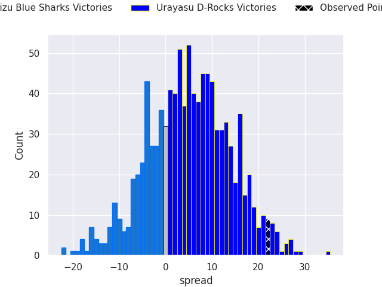
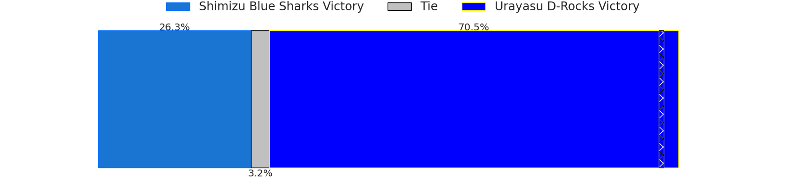
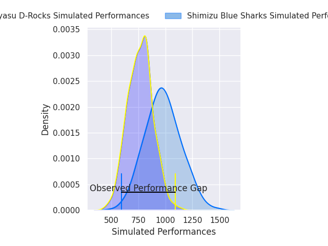
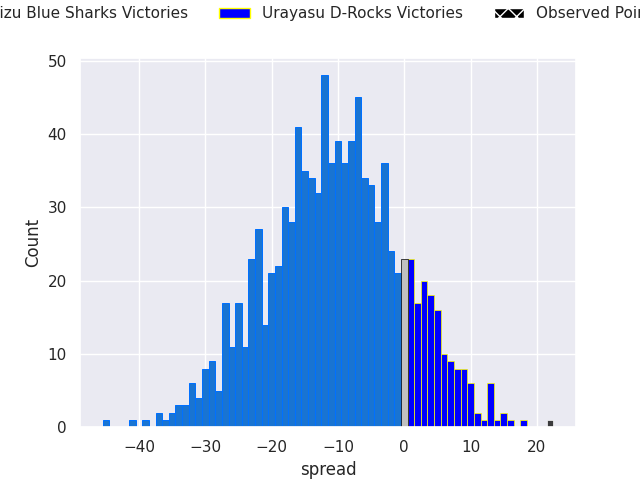
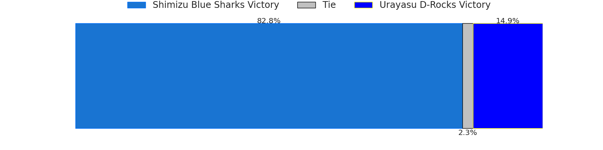

# Shimizu Blue Sharks V Urayasu D-Rocks on 2026/05/23, 15.0 to 37.0

# Club Level Predictions

Now that the game has been played, lets see how the club predictions did. I predicted Urayasu D-Rocks to win by 5.19, and Urayasu D-Rocks won by 22.0. That's an absolute error of 16.8 for the margin of victory, while my average absolute error has been 14.1 over the past six months. This prediction was more accurate than 31.9% of my recent predictions.

For the Over/Under model, I predicted a total of 50.5 and we have an actual total of 52.0. That's an absolute error of 1.5 compared to a six month average of 13.7. This prediction was more accurate than 93.5% of my recent predictions.
## Projected Performances - Club Model

## Projected Spreads - Club Model

## Projected Results - Club Model

# Player Level Predictions

With the player model, I predicted Shimizu Blue Sharks to win by 10.43,  and Urayasu D-Rocks won by 22.0. That's an absolute error of 32.4 for the margin of victory, while the average error as been 14.0 for the past six months. So this prediction was more accurate than 7.2% of my recent predictions.
## Projected Performances - Player Model

## Projected Spreads - Player Model

## Projected Results - Player Model

