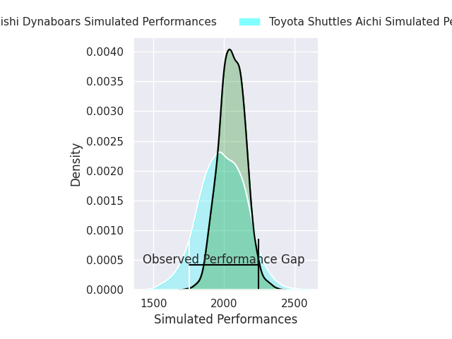
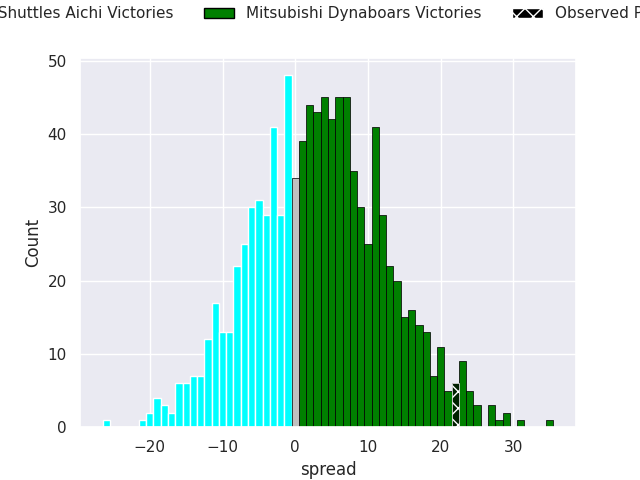
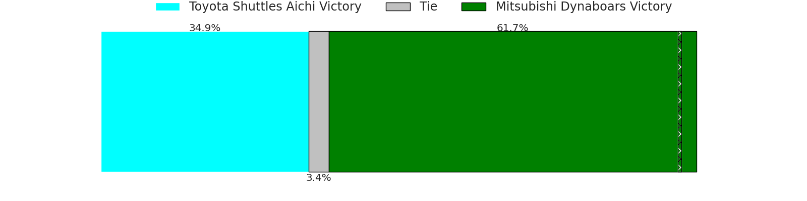
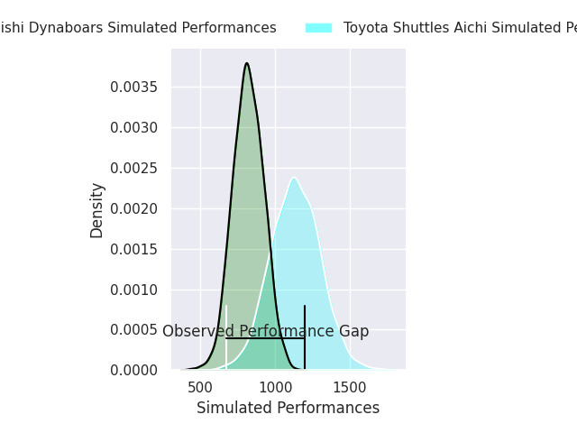
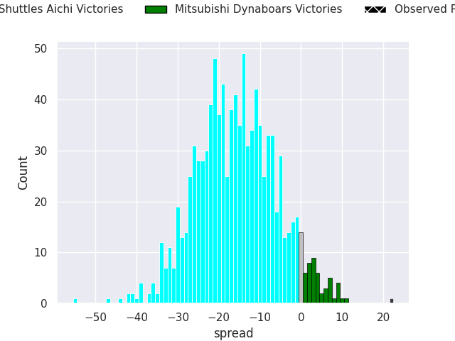
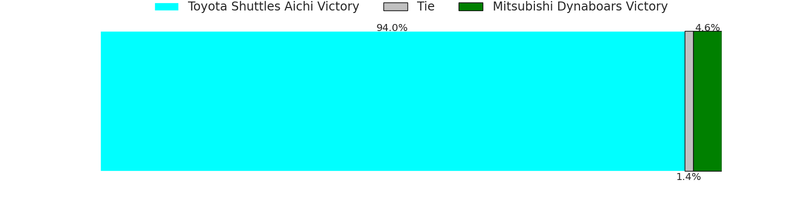

# Toyota Shuttles Aichi V Mitsubishi Dynaboars on 2026/05/23, 14.0 to 36.0

# Club Level Predictions

Now that the game has been played, lets see how the club predictions did. I predicted Mitsubishi Dynaboars to win by 3.34, and Mitsubishi Dynaboars won by 22.0. That's an absolute error of 18.7 for the margin of victory, while my average absolute error has been 14.1 over the past six months. This prediction was more accurate than 27.5% of my recent predictions.

For the Over/Under model, I predicted a total of 53.5 and we have an actual total of 50.0. That's an absolute error of 3.5 compared to a six month average of 13.7. This prediction was more accurate than 84.6% of my recent predictions.
## Projected Performances - Club Model

## Projected Spreads - Club Model

## Projected Results - Club Model

# Player Level Predictions

With the player model, I predicted Toyota Shuttles Aichi to win by 15.81,  and Mitsubishi Dynaboars won by 22.0. That's an absolute error of 37.8 for the margin of victory, while the average error as been 14.0 for the past six months. So this prediction was more accurate than 4.9% of my recent predictions.
## Projected Performances - Player Model

## Projected Spreads - Player Model

## Projected Results - Player Model

