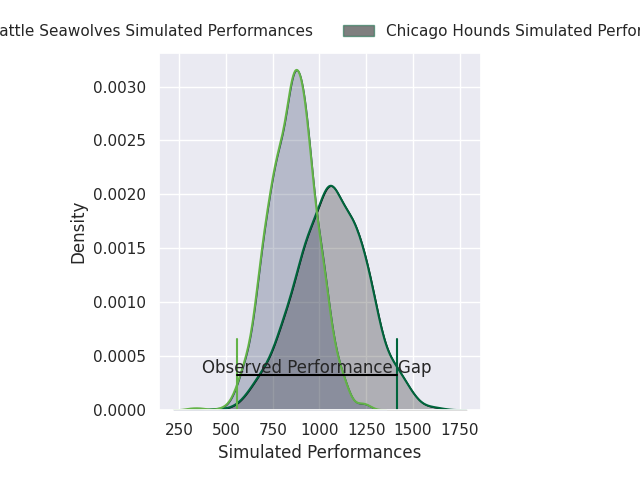
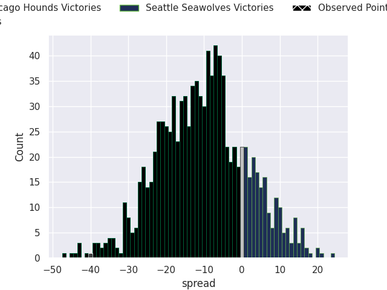
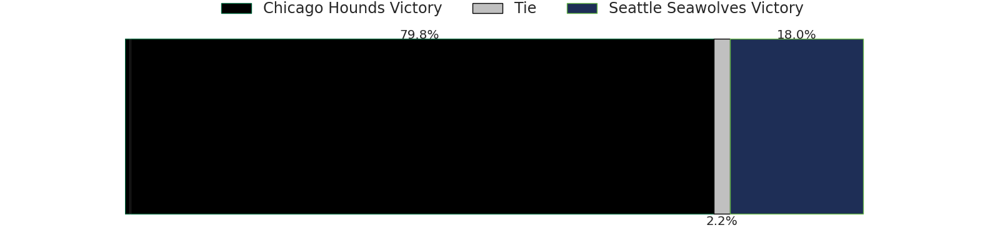

# Chicago Hounds V Seattle Seawolves on 2026/05/24, 57.0 to 17.0

# Club Level Predictions

Now that the game has been played, lets see how the club predictions did. I predicted Chicago Hounds to win by 20.37, and Chicago Hounds won by 40.0. That's an absolute error of 19.6 for the margin of victory, while my average absolute error has been 14.0 over the past six months. This prediction was more accurate than 25.3% of my recent predictions.

For the Over/Under model, I predicted a total of 49.5 and we have an actual total of 74.0. That's an absolute error of 24.5 compared to a six month average of 13.7. This prediction was more accurate than 17.3% of my recent predictions.
## Projected Performances - Club Model

## Projected Spreads - Club Model

## Projected Results - Club Model

# Player Level Predictions

With the player model, I predicted Chicago Hounds to win by 10.38,  and Chicago Hounds won by 40.0. That's an absolute error of 29.6 for the margin of victory, while the average error as been 13.8 for the past six months. So this prediction was more accurate than 8.9% of my recent predictions.
## Projected Performances - Player Model

## Projected Spreads - Player Model

## Projected Results - Player Model

