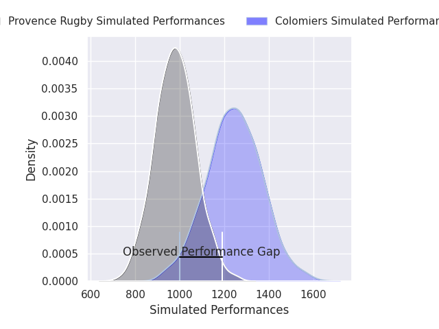
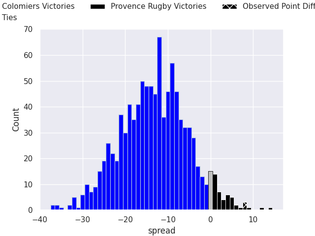
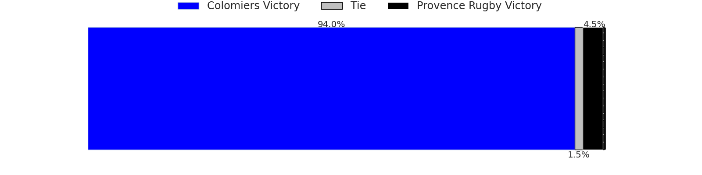

# Colomiers V Provence Rugby on 2026/05/29, 28.0 to 36.0

# Club Level Predictions

Now that the game has been played, lets see how the club predictions did. I predicted Colomiers to win by 8.4, and Provence Rugby won by 8.0. That's an absolute error of 16.4 for the margin of victory, while my average absolute error has been 14.2 over the past six months. This prediction was more accurate than 33.0% of my recent predictions.

For the Over/Under model, I predicted a total of 49.5 and we have an actual total of 64.0. That's an absolute error of 14.5 compared to a six month average of 13.7. This prediction was more accurate than 38.3% of my recent predictions.
## Projected Performances - Club Model

## Projected Spreads - Club Model

## Projected Results - Club Model

# Player Level Predictions

With the player model, I predicted Colomiers to win by 13.19,  and Provence Rugby won by 8.0. That's an absolute error of 21.2 for the margin of victory, while the average error as been 14.0 for the past six months. So this prediction was more accurate than 19.0% of my recent predictions.
## Projected Performances - Player Model

## Projected Spreads - Player Model

## Projected Results - Player Model

