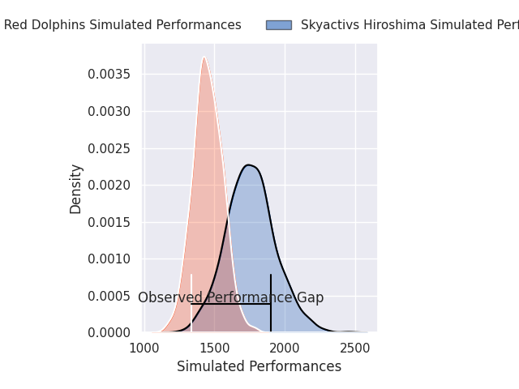
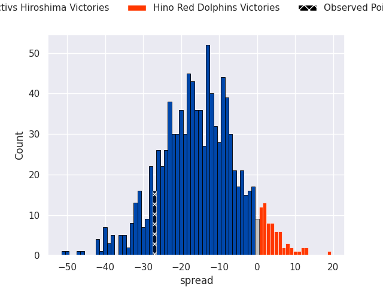
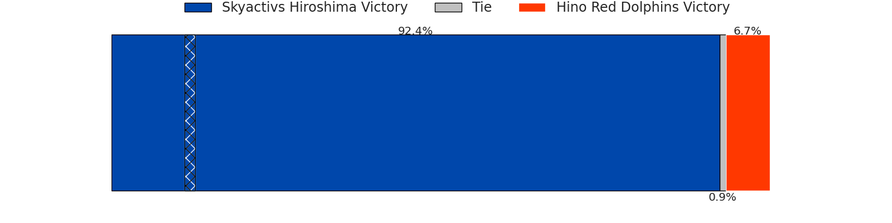

# Skyactivs Hiroshima V Hino Red Dolphins on 2026/05/29, 40.0 to 13.0

# Club Level Predictions

Now that the game has been played, lets see how the club predictions did. I predicted Skyactivs Hiroshima to win by 15.24, and Skyactivs Hiroshima won by 27.0. That's an absolute error of 11.8 for the margin of victory, while my average absolute error has been 14.2 over the past six months. This prediction was more accurate than 47.3% of my recent predictions.

For the Over/Under model, I predicted a total of 54.5 and we have an actual total of 53.0. That's an absolute error of 1.5 compared to a six month average of 13.7. This prediction was more accurate than 93.5% of my recent predictions.
## Projected Performances - Club Model

## Projected Spreads - Club Model

## Projected Results - Club Model

