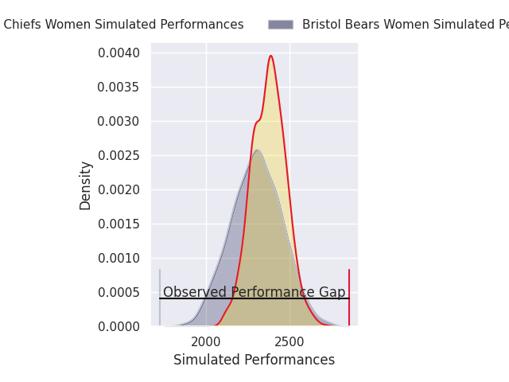
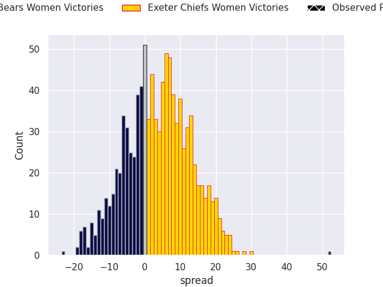

# Bristol Bears Women V Exeter Chiefs Women on 2026/05/30, 5.0 to 57.0

# Club Level Predictions

Now that the game has been played, lets see how the club predictions did. I predicted Exeter Chiefs Women to win by 3.7, and Exeter Chiefs Women won by 52.0. That's an absolute error of 48.3 for the margin of victory, while my average absolute error has been 14.2 over the past six months. This prediction was more accurate than 1.9% of my recent predictions.

For the Over/Under model, I predicted a total of 42.5 and we have an actual total of 62.0. That's an absolute error of 19.5 compared to a six month average of 13.7. This prediction was more accurate than 25.4% of my recent predictions.
## Projected Performances - Club Model

## Projected Spreads - Club Model

## Projected Results - Club Model

