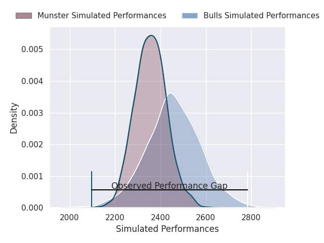
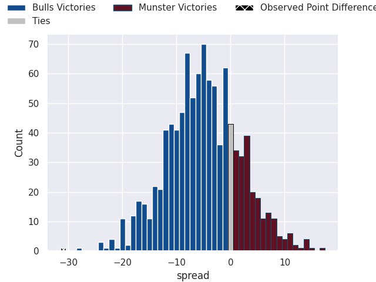
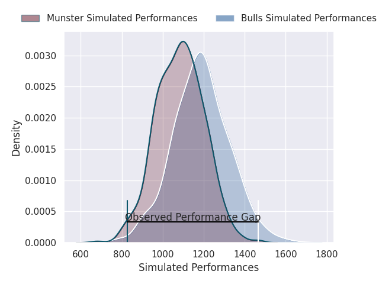
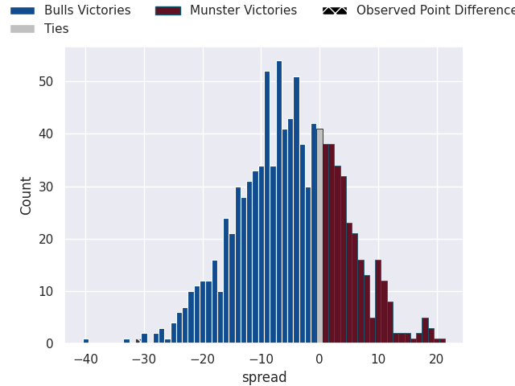

# Bulls V Munster on 2026/05/30, 45.0 to 14.0

# Club Level Predictions

Now that the game has been played, lets see how the club predictions did. I predicted Bulls to win by 5.03, and Bulls won by 31.0. That's an absolute error of 26.0 for the margin of victory, while my average absolute error has been 14.2 over the past six months. This prediction was more accurate than 15.3% of my recent predictions.

For the Over/Under model, I predicted a total of 46.5 and we have an actual total of 59.0. That's an absolute error of 12.5 compared to a six month average of 13.7. This prediction was more accurate than 44.2% of my recent predictions.
## Projected Performances - Club Model

## Projected Spreads - Club Model

## Projected Results - Club Model

# Player Level Predictions

With the player model, I predicted Bulls to win by 5.08,  and Bulls won by 31.0. That's an absolute error of 25.9 for the margin of victory, while the average error as been 14.0 for the past six months. So this prediction was more accurate than 12.5% of my recent predictions.
## Projected Performances - Player Model

## Projected Spreads - Player Model

## Projected Results - Player Model

