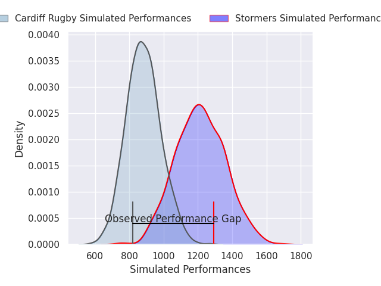
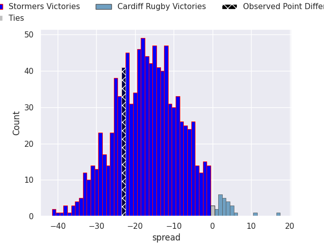
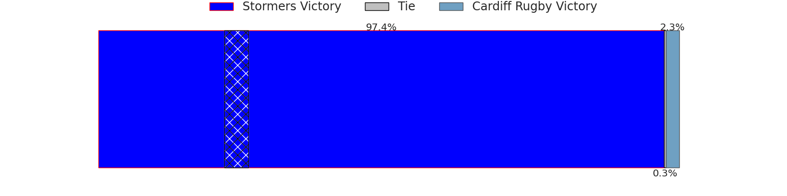

# Stormers V Cardiff Rugby on 2026/05/30, 44.0 to 21.0

# Club Level Predictions

Now that the game has been played, lets see how the club predictions did. I predicted Stormers to win by 10.0, and Stormers won by 23.0. That's an absolute error of 13.0 for the margin of victory, while my average absolute error has been 14.2 over the past six months. This prediction was more accurate than 43.7% of my recent predictions.

For the Over/Under model, I predicted a total of 46.5 and we have an actual total of 65.0. That's an absolute error of 18.5 compared to a six month average of 13.7. This prediction was more accurate than 28.2% of my recent predictions.
## Projected Performances - Club Model

## Projected Spreads - Club Model

## Projected Results - Club Model

# Player Level Predictions

With the player model, I predicted Stormers to win by 16.57,  and Stormers won by 23.0. That's an absolute error of 6.4 for the margin of victory, while the average error as been 14.0 for the past six months. So this prediction was more accurate than 59.7% of my recent predictions.
## Projected Performances - Player Model

## Projected Spreads - Player Model

## Projected Results - Player Model

