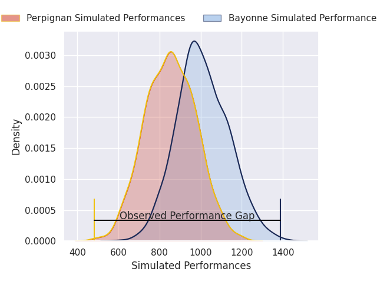
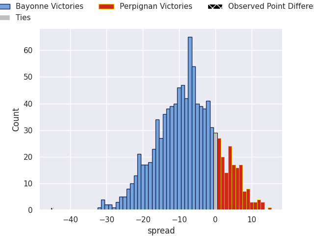
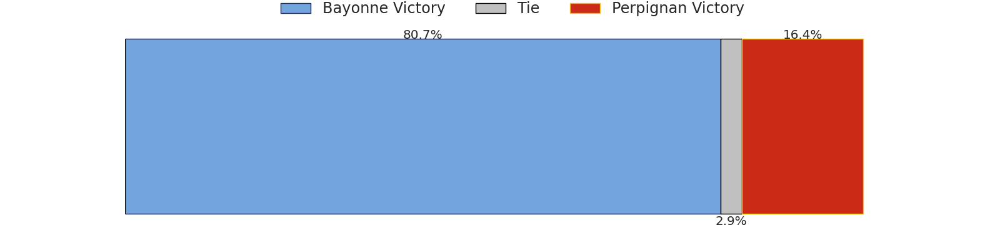

# Bayonne V Perpignan on 2026/06/06, 52.0 to 7.0

# Club Level Predictions

Now that the game has been played, lets see how the club predictions did. I predicted Bayonne to win by 6.34, and Bayonne won by 45.0. That's an absolute error of 38.7 for the margin of victory, while my average absolute error has been 14.2 over the past six months. This prediction was more accurate than 5.2% of my recent predictions.

For the Over/Under model, I predicted a total of 50.5 and we have an actual total of 59.0. That's an absolute error of 8.5 compared to a six month average of 13.9. This prediction was more accurate than 62.5% of my recent predictions.
## Projected Performances - Club Model

## Projected Spreads - Club Model

## Projected Results - Club Model

# Player Level Predictions

With the player model, I predicted Bayonne to win by 7.8,  and Bayonne won by 45.0. That's an absolute error of 37.2 for the margin of victory, while the average error as been 14.0 for the past six months. So this prediction was more accurate than 5.1% of my recent predictions.
## Projected Performances - Player Model

## Projected Spreads - Player Model

## Projected Results - Player Model

