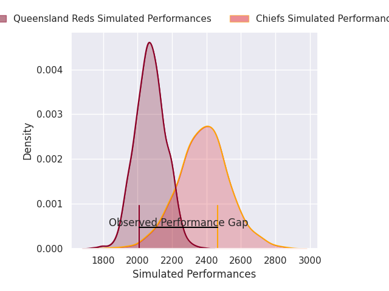
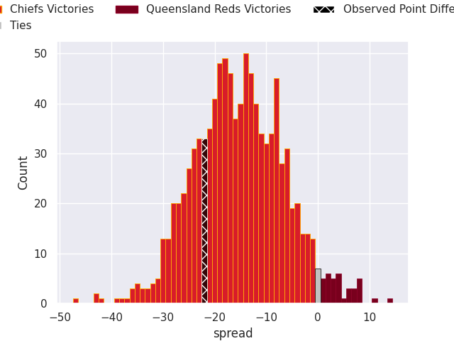

# Chiefs V Queensland Reds on 2026/06/06, 46.0 to 24.0

# Club Level Predictions

Now that the game has been played, lets see how the club predictions did. I predicted Chiefs to win by 15.3, and Chiefs won by 22.0. That's an absolute error of 6.7 for the margin of victory, while my average absolute error has been 14.2 over the past six months. This prediction was more accurate than 67.1% of my recent predictions.

For the Over/Under model, I predicted a total of 50.5 and we have an actual total of 70.0. That's an absolute error of 19.5 compared to a six month average of 14.0. This prediction was more accurate than 26.3% of my recent predictions.
## Projected Performances - Club Model

## Projected Spreads - Club Model

## Projected Results - Club Model

