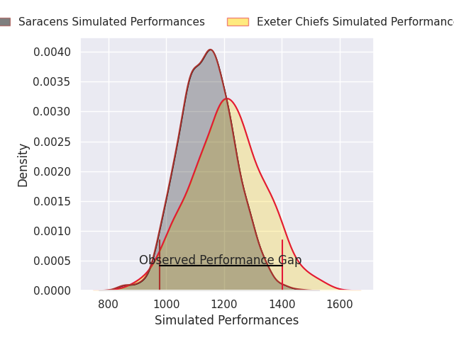
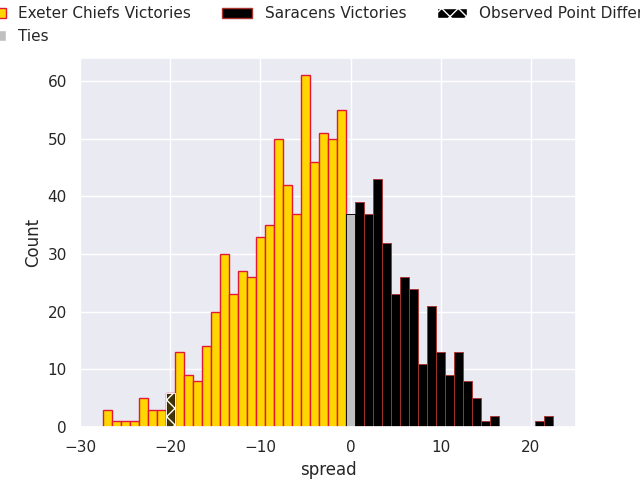
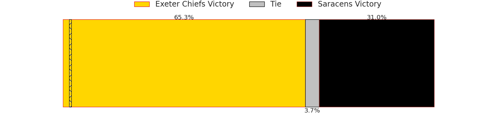

# Exeter Chiefs V Saracens on 2026/06/06, 32.0 to 12.0

# Club Level Predictions

Now that the game has been played, lets see how the club predictions did. I predicted Exeter Chiefs to win by 6.34, and Exeter Chiefs won by 20.0. That's an absolute error of 13.7 for the margin of victory, while my average absolute error has been 14.2 over the past six months. This prediction was more accurate than 41.7% of my recent predictions.

For the Over/Under model, I predicted a total of 48.5 and we have an actual total of 44.0. That's an absolute error of 4.5 compared to a six month average of 13.9. This prediction was more accurate than 79.6% of my recent predictions.
## Projected Performances - Club Model

## Projected Spreads - Club Model

## Projected Results - Club Model

# Player Level Predictions

With the player model, I predicted Exeter Chiefs to win by 3.52,  and Exeter Chiefs won by 20.0. That's an absolute error of 16.5 for the margin of victory, while the average error as been 14.0 for the past six months. So this prediction was more accurate than 27.0% of my recent predictions.
## Projected Performances - Player Model

## Projected Spreads - Player Model

## Projected Results - Player Model

