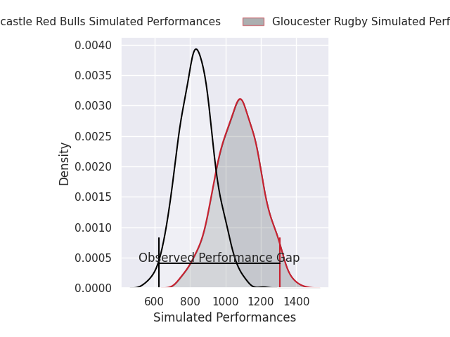
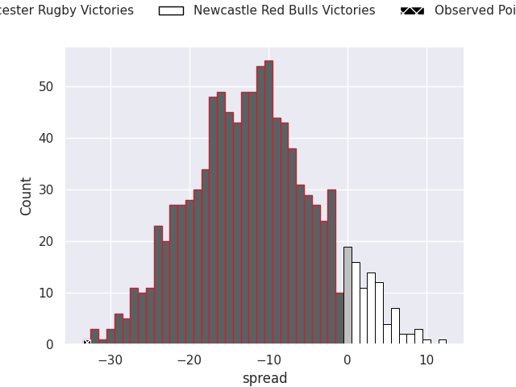
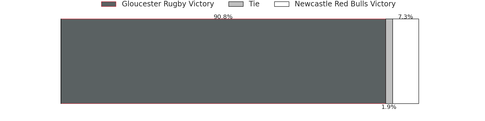

# Gloucester Rugby V Newcastle Red Bulls on 2026/06/06, 54.0 to 21.0

# Club Level Predictions

Now that the game has been played, lets see how the club predictions did. I predicted Gloucester Rugby to win by 13.77, and Gloucester Rugby won by 33.0. That's an absolute error of 19.2 for the margin of victory, while my average absolute error has been 14.2 over the past six months. This prediction was more accurate than 26.1% of my recent predictions.

For the Over/Under model, I predicted a total of 47.5 and we have an actual total of 75.0. That's an absolute error of 27.5 compared to a six month average of 14.0. This prediction was more accurate than 12.7% of my recent predictions.
## Projected Performances - Club Model

## Projected Spreads - Club Model

## Projected Results - Club Model

# Player Level Predictions

With the player model, I predicted Gloucester Rugby to win by 11.88,  and Gloucester Rugby won by 33.0. That's an absolute error of 21.1 for the margin of victory, while the average error as been 14.0 for the past six months. So this prediction was more accurate than 19.4% of my recent predictions.
## Projected Performances - Player Model

## Projected Spreads - Player Model

## Projected Results - Player Model

