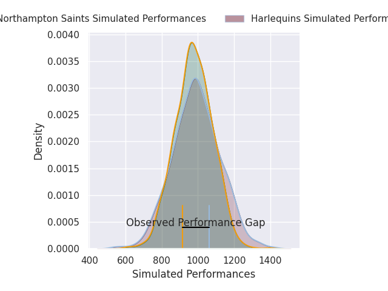
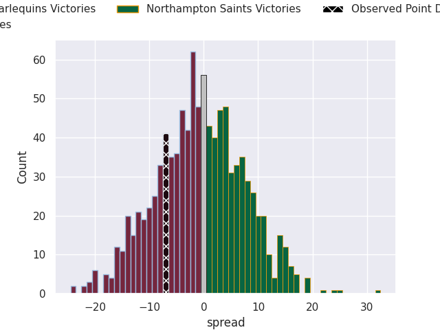

# Harlequins V Northampton Saints on 2026/06/06, 38.0 to 31.0

# Club Level Predictions

Now that the game has been played, lets see how the club predictions did. I predicted Northampton Saints to win by 4.69, and Harlequins won by 7.0. That's an absolute error of 11.7 for the margin of victory, while my average absolute error has been 14.2 over the past six months. This prediction was more accurate than 47.8% of my recent predictions.

For the Over/Under model, I predicted a total of 53.5 and we have an actual total of 69.0. That's an absolute error of 15.5 compared to a six month average of 14.0. This prediction was more accurate than 35.7% of my recent predictions.
## Projected Performances - Club Model

## Projected Spreads - Club Model

## Projected Results - Club Model

# Player Level Predictions

With the player model, I predicted Harlequins to win by 0.72,  and Harlequins won by 7.0. That's an absolute error of 6.3 for the margin of victory, while the average error as been 14.0 for the past six months. So this prediction was more accurate than 59.1% of my recent predictions.
## Projected Performances - Player Model

## Projected Spreads - Player Model

## Projected Results - Player Model

