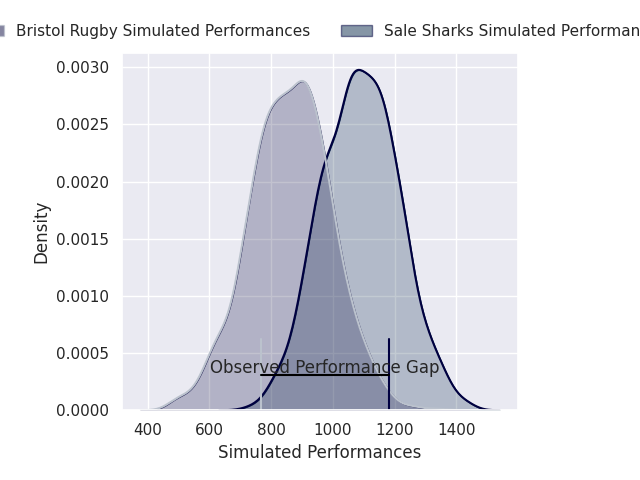
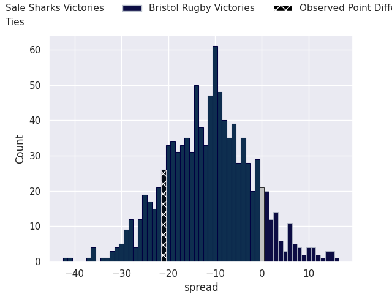
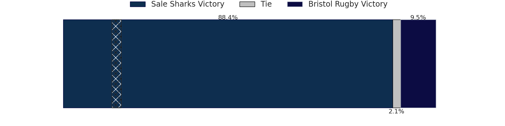

# Sale Sharks V Bristol Rugby on 2026/06/06, 38.0 to 17.0

# Club Level Predictions

Now that the game has been played, lets see how the club predictions did. I predicted Sale Sharks to win by 2.91, and Sale Sharks won by 21.0. That's an absolute error of 18.1 for the margin of victory, while my average absolute error has been 14.2 over the past six months. This prediction was more accurate than 28.9% of my recent predictions.

For the Over/Under model, I predicted a total of 49.5 and we have an actual total of 55.0. That's an absolute error of 5.5 compared to a six month average of 14.0. This prediction was more accurate than 75.2% of my recent predictions.
## Projected Performances - Club Model

## Projected Spreads - Club Model

## Projected Results - Club Model

# Player Level Predictions

With the player model, I predicted Sale Sharks to win by 11.28,  and Sale Sharks won by 21.0. That's an absolute error of 9.7 for the margin of victory, while the average error as been 14.0 for the past six months. So this prediction was more accurate than 45.2% of my recent predictions.
## Projected Performances - Player Model

## Projected Spreads - Player Model

## Projected Results - Player Model

