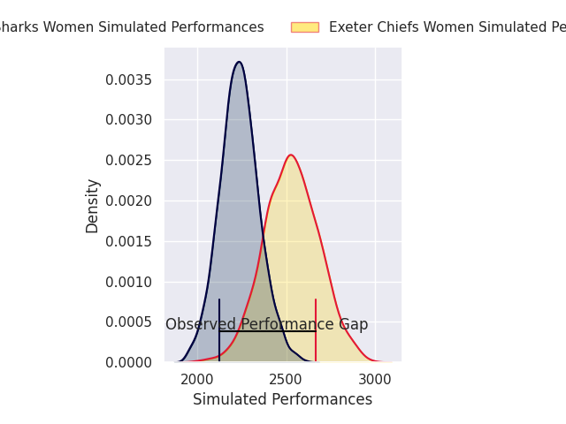
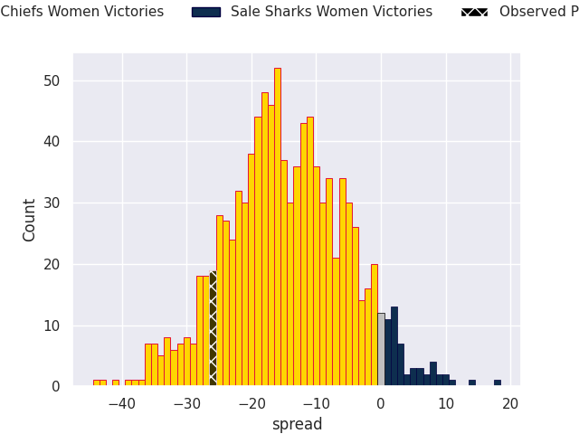
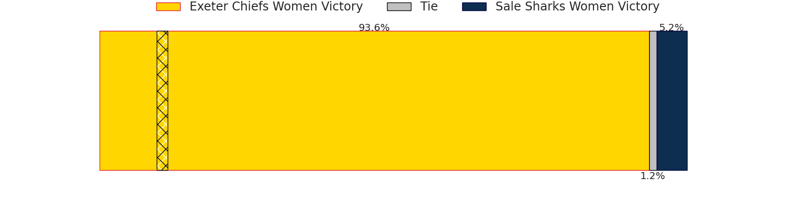

# Exeter Chiefs Women V Sale Sharks Women on 2026/06/07, 50.0 to 24.0

# Club Level Predictions

Now that the game has been played, lets see how the club predictions did. I predicted Exeter Chiefs Women to win by 14.64, and Exeter Chiefs Women won by 26.0. That's an absolute error of 11.4 for the margin of victory, while my average absolute error has been 14.2 over the past six months. This prediction was more accurate than 48.8% of my recent predictions.

For the Over/Under model, I predicted a total of 39.5 and we have an actual total of 74.0. That's an absolute error of 34.5 compared to a six month average of 14.0. This prediction was more accurate than 5.4% of my recent predictions.
## Projected Performances - Club Model

## Projected Spreads - Club Model

## Projected Results - Club Model

