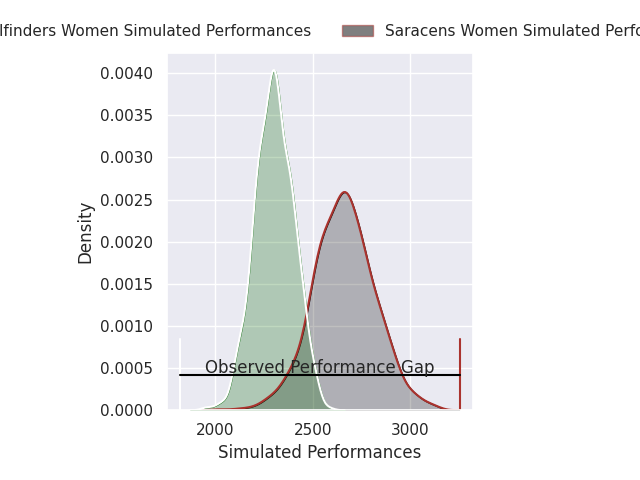
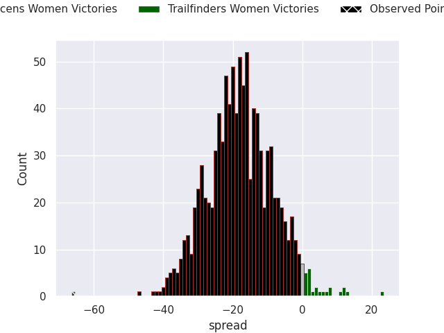

# Saracens Women V Trailfinders Women on 2026/06/07, 80.0 to 14.0

# Club Level Predictions

Now that the game has been played, lets see how the club predictions did. I predicted Saracens Women to win by 17.85, and Saracens Women won by 66.0. That's an absolute error of 48.2 for the margin of victory, while my average absolute error has been 14.2 over the past six months. This prediction was more accurate than 1.9% of my recent predictions.

For the Over/Under model, I predicted a total of 50.5 and we have an actual total of 94.0. That's an absolute error of 43.5 compared to a six month average of 14.0. This prediction was more accurate than 1.5% of my recent predictions.
## Projected Performances - Club Model

## Projected Spreads - Club Model

## Projected Results - Club Model

