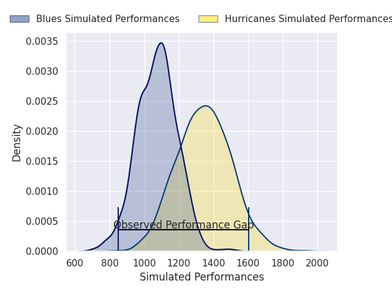
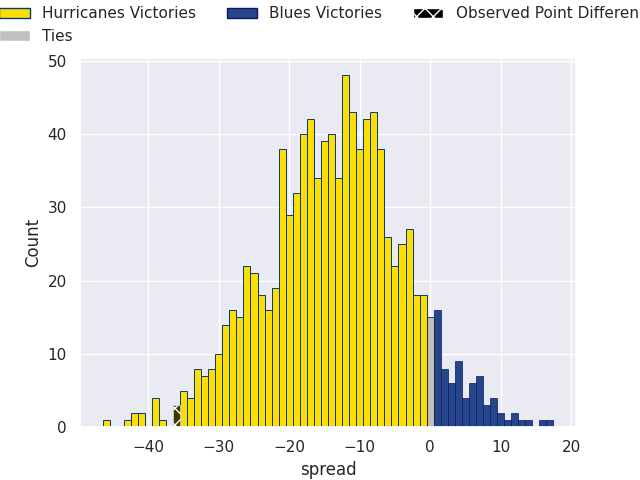
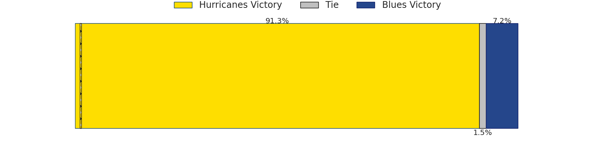

# Hurricanes V Blues on 2026/06/13, 57.0 to 21.0

# Club Level Predictions

Now that the game has been played, lets see how the club predictions did. I predicted Hurricanes to win by 12.16, and Hurricanes won by 36.0. That's an absolute error of 23.8 for the margin of victory, while my average absolute error has been 14.2 over the past six months. This prediction was more accurate than 18.2% of my recent predictions.

For the Over/Under model, I predicted a total of 51.5 and we have an actual total of 78.0. That's an absolute error of 26.5 compared to a six month average of 14.0. This prediction was more accurate than 14.4% of my recent predictions.
## Projected Performances - Club Model

## Projected Spreads - Club Model

## Projected Results - Club Model

# Player Level Predictions

With the player model, I predicted Hurricanes to win by 13.58,  and Hurricanes won by 36.0. That's an absolute error of 22.4 for the margin of victory, while the average error as been 14.0 for the past six months. So this prediction was more accurate than 16.9% of my recent predictions.
## Projected Performances - Player Model

## Projected Spreads - Player Model

## Projected Results - Player Model

