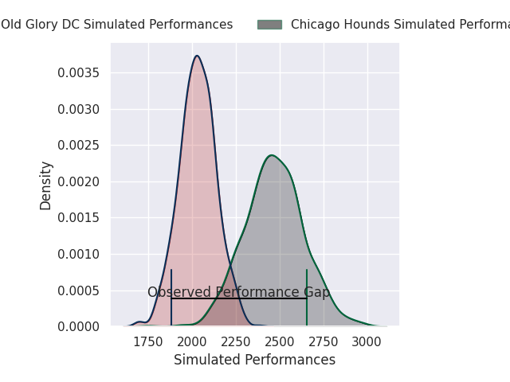
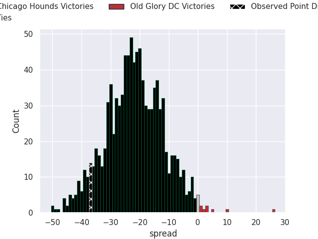
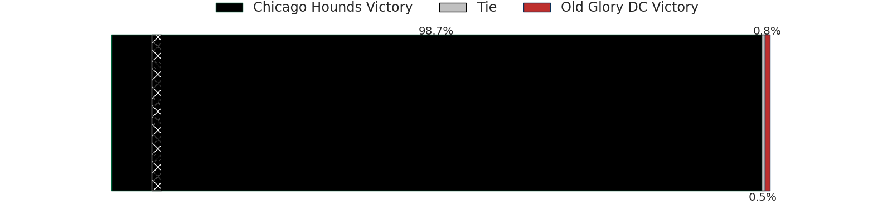

# Chicago Hounds V Old Glory DC on 2026/06/15, 59.0 to 22.0

# Club Level Predictions

Now that the game has been played, lets see how the club predictions did. I predicted Chicago Hounds to win by 21.82, and Chicago Hounds won by 37.0. That's an absolute error of 15.2 for the margin of victory, while my average absolute error has been 14.4 over the past six months. This prediction was more accurate than 36.6% of my recent predictions.

For the Over/Under model, I predicted a total of 48.5 and we have an actual total of 81.0. That's an absolute error of 32.5 compared to a six month average of 14.2. This prediction was more accurate than 7.4% of my recent predictions.
## Projected Performances - Club Model

## Projected Spreads - Club Model

## Projected Results - Club Model

