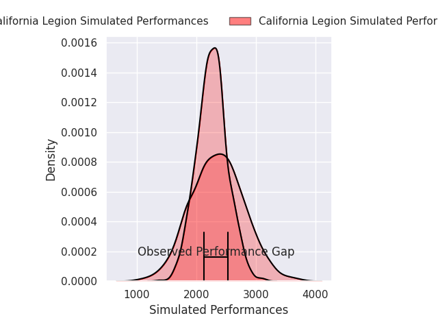
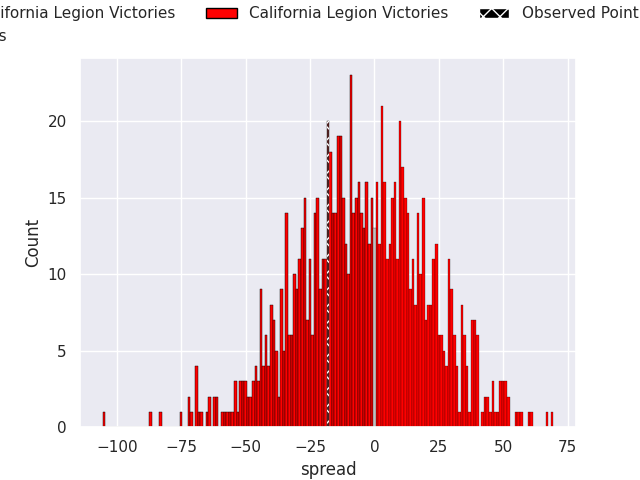
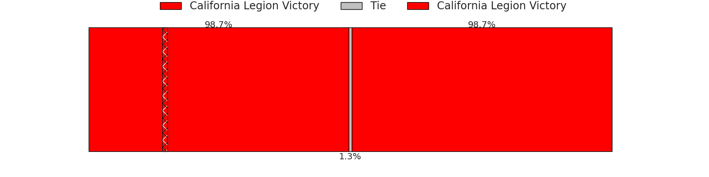

# California Legion V Chicago Hounds on 2026/06/21, 35.0 to 17.0

# Club Level Predictions

Now that the game has been played, lets see how the club predictions did. I predicted California Legion to win by 4.6, and California Legion won by 18.0. That's an absolute error of 13.4 for the margin of victory, while my average absolute error has been 14.4 over the past six months. This prediction was more accurate than 42.8% of my recent predictions.

For the Over/Under model, I predicted a total of 52.5 and we have an actual total of 52.0. That's an absolute error of 0.5 compared to a six month average of 14.2. This prediction was more accurate than 97.5% of my recent predictions.
## Projected Performances - Club Model

## Projected Spreads - Club Model

## Projected Results - Club Model

