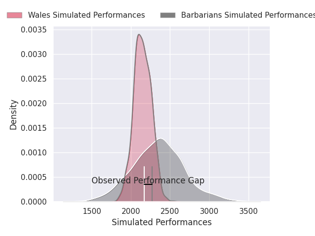
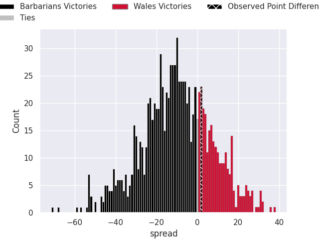
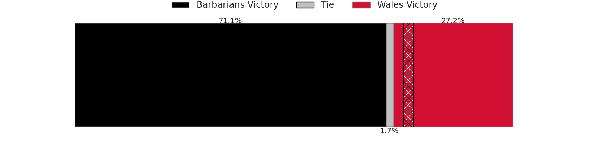
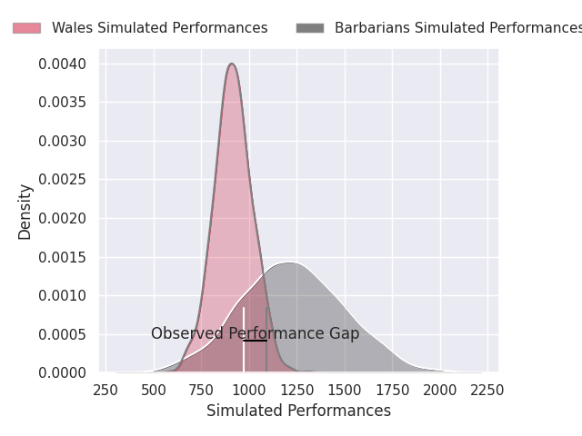
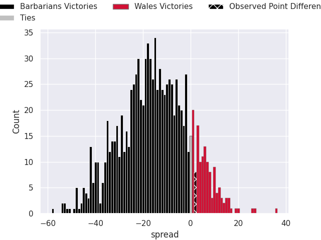

# Barbarians V Wales on 2026/06/27, 31.0 to 33.0

# Club Level Predictions

Now that the game has been played, lets see how the club predictions did. I predicted Barbarians to win by 10.1, and Wales won by 2.0. That's an absolute error of 12.1 for the margin of victory, while my average absolute error has been 14.4 over the past six months. This prediction was more accurate than 46.9% of my recent predictions.

For the Over/Under model, I predicted a total of 80.5 and we have an actual total of 64.0. That's an absolute error of 16.5 compared to a six month average of 14.3. This prediction was more accurate than 34.0% of my recent predictions.
## Projected Performances - Club Model

## Projected Spreads - Club Model

## Projected Results - Club Model

# Player Level Predictions

With the player model, I predicted Barbarians to win by 15.59,  and Wales won by 2.0. That's an absolute error of 17.6 for the margin of victory, while the average error as been 14.3 for the past six months. So this prediction was more accurate than 24.9% of my recent predictions.
## Projected Performances - Player Model

## Projected Spreads - Player Model

## Projected Results - Player Model

