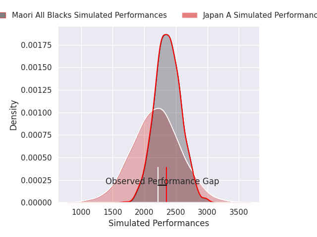
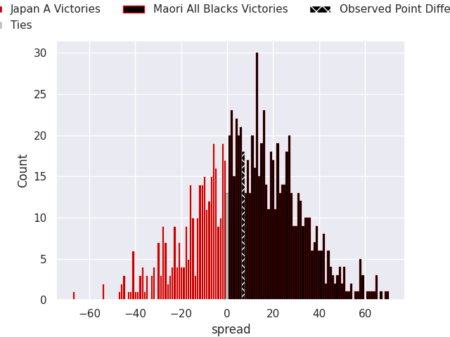
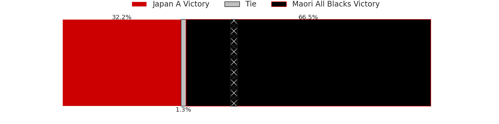

# Japan A V Maori All Blacks on 2026/06/27, 31.0 to 38.0

# Club Level Predictions

Now that the game has been played, lets see how the club predictions did. I predicted Maori All Blacks to win by 8.98, and Maori All Blacks won by 7.0. That's an absolute error of 2.0 for the margin of victory, while my average absolute error has been 14.4 over the past six months. This prediction was more accurate than 89.3% of my recent predictions.

For the Over/Under model, I predicted a total of 53.5 and we have an actual total of 69.0. That's an absolute error of 15.5 compared to a six month average of 14.3. This prediction was more accurate than 36.7% of my recent predictions.
## Projected Performances - Club Model

## Projected Spreads - Club Model

## Projected Results - Club Model

